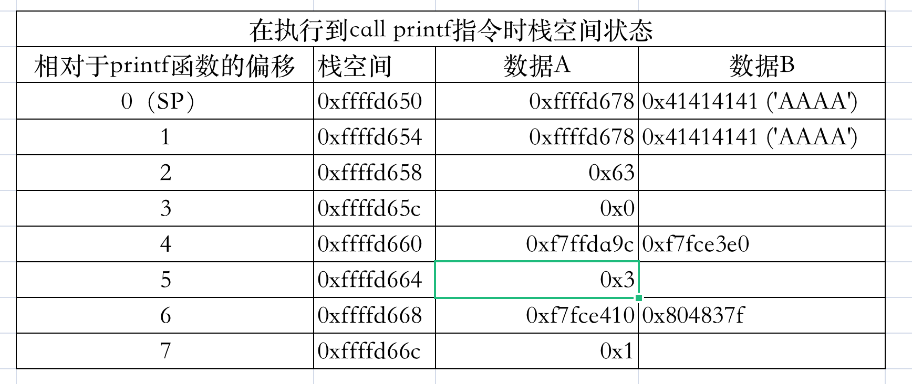

## 格式化字符串漏洞利用

### 0x001-格式化字符串漏洞任意地址读取



> %x : 以十六进制形式打印栈中 **数据A** 的值

> %d : 以十进制形式打印栈中 **数据A** 的值

> %p : 以指针形式（十六进制）打印栈中 **数据A** 的值

> %s : 以字符串形式打印栈中 **数据B** 的值

通过 **%n\$x** 可以打印栈中任意位置 **数据A** 的值，或者通过 **%n\$s** 可以打印栈中任意位置 **数据B** 的值，n为偏移量控制栈的位置，一般 n>=1。

也可以使用 **地址+%n$s** 打印任意地址中保存的内容，此时 **n** 为输入内容相对于 **printf** 的偏移量。

### 0x002-格式化字符串漏洞任意地址写入

> %c : 输出字符，可以配合 **%n** 使用

> %n : 把已经成功输出的字符个数写入对应的整型指针参数所指的变量中

例如，可以使用 **p32(0x804c044) + b"%10$n"**，将 4 写入 **0x804c044** 中，因为 **p32(0x804c044)** 打印出来是4个字符；

也可以使用 **p32(atoi_got) + b"%" + str(system_plt-4).encode() + b"c%10$n"** 将 **atoi** 函数的GOT地址修改为 **system** 函数的PLT地址。

pwntools提供了格式化字符串漏洞利用的函数 **fmtstr_payload**：
```
pwnlib.fmtstr.fmtstr_payload(offset, writes, numbwritten=0, write_size='byte')
```

1. offset即为栈中指向被改写区域指针相对格式化字符串指针的偏移（作为第几个参数）；
2. writes是一个字典，为要改写的值和目标值，即用value的值替换掉内存中key指向的区域；
3. numbwritten即为在之前已经输出的字符数；
4. write_size为mei每次改写的size，一般使用byte（hhn），以避免程序崩溃或连接断开。

### 0x003-格式化字符串漏洞未解之疑惑

在使用任意地址写入时，可以将要写入内容的地址放在前面，也可以将该地址放在后面，还没弄明白这两者的区别，有待解决。